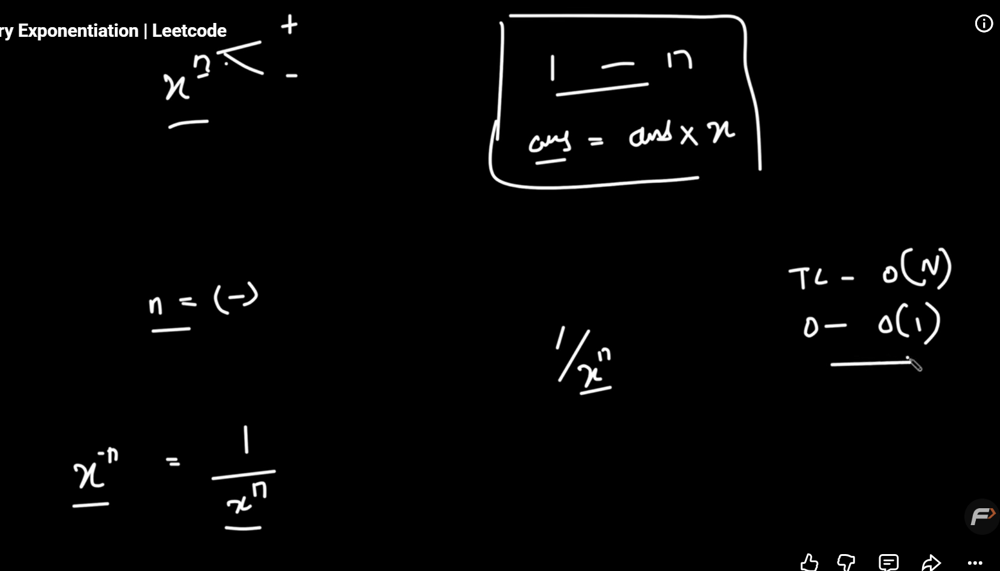
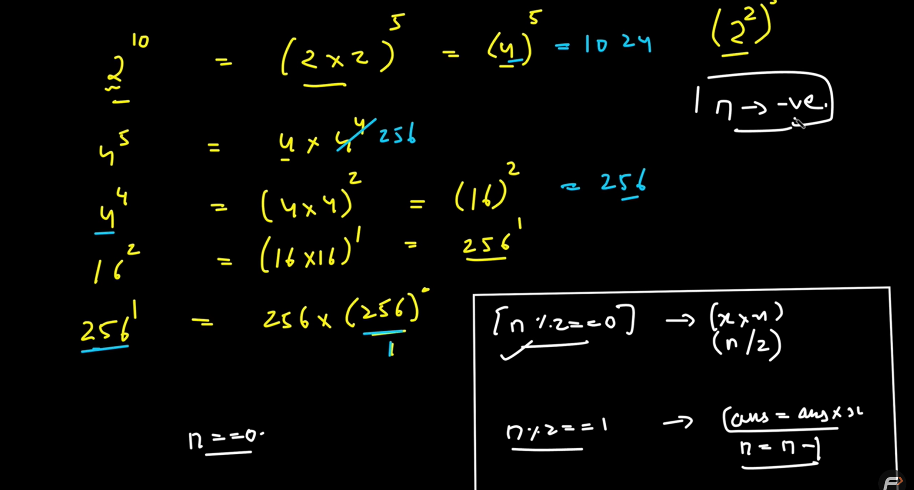
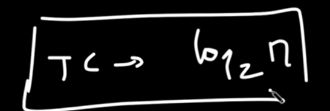
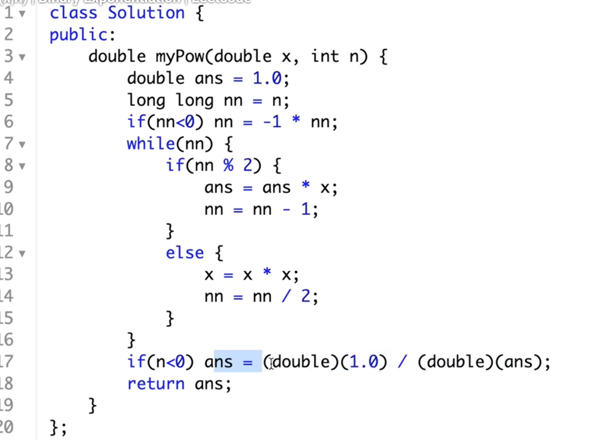

pow brute



optimal





rec_optimal

Algorithm
Define a helper function that handles the recursive calculation of the power.
Base Case 1: If the exponent n is 0, return 1 because any number raised to the power of 0 is 1.
Base Case 2: If the exponent n is 1, return the base x, since any number raised to the power
 of 1 is itself.
If the exponent n is even:
If true, recursively calculate the power by squaring the base and halving the exponent:
power(x, n) = power(x * x, n / 2)
If the exponent n is odd:
If true, recursively calculate the power by multiplying the base with the result of the power function for n - 1:
power(x, n) = x * power(x, n - 1)
Handle negative exponents:
If the exponent is negative, calculate the power for the positive exponent and take the reciprocal 
of the result.
Finally, combine these steps in a main function that checks if the exponent is negative and 
calls the helper function accordingly.

sort stack explaination
first  empty then inser sorted


This solution sorts a stack **using recursion only**, without using any loops or extra data structures.

---

# Key Idea

The algorithm works in two phases:

1. **Remove all elements recursively** until the stack becomes empty.
2. **Insert elements back one by one in sorted order** using another recursive function.

This is similar to how insertion sort works.

---

# Initial Stack

The code pushes elements in this order:

```cpp
s.push(4);
s.push(1);
s.push(3);
s.push(2);
```

Stack representation:

```
TOP
2
3
1
4
BOTTOM
```

---

# Function 1: `sortStack()`

```cpp
void sortStack(stack<int>& s) {
    if (!s.empty()) {
        int temp = s.top();
        s.pop();

        sortStack(s);

        insert(s, temp);
    }
}
```

### What it does

* Removes the top element.
* Recursively sorts the remaining stack.
* Inserts the removed element back in the correct position.

---

## Recursive Calls

### Call 1

Stack:

```
2
3
1
4
```

Pop `2`

```
3
1
4
```

Call `sortStack()` again.

---

### Call 2

Pop `3`

```
1
4
```

Call `sortStack()` again.

---

### Call 3

Pop `1`

```
4
```

Call `sortStack()` again.

---

### Call 4

Pop `4`

```
empty
```

Call `sortStack()` again.

---

### Base Case

Stack is empty.

Return.

Now recursion starts **unwinding**.

---

# Function 2: `insert()`

```cpp
void insert(stack<int>& s, int temp) {
    if (s.empty() || s.top() <= temp) {
        s.push(temp);
        return;
    }

    int val = s.top();
    s.pop();

    insert(s, temp);

    s.push(val);
}
```

### Purpose

Insert an element into an already sorted stack while keeping it sorted.

Condition:

```cpp
s.top() <= temp
```

means:

> If the current top is smaller than or equal to `temp`,
> put `temp` above it.

This ensures larger elements stay closer to the top.

---

# Unwinding Step-by-Step

---

## Insert 4

Stack:

```
empty
```

Push 4.

```
4
```

---

## Insert 1

Current stack:

```
4
```

Check:

```cpp
4 <= 1 ? false
```

Pop 4.

Insert 1 into empty stack.

```
1
```

Push 4 back.

```
4
1
```

---

## Insert 3

Current stack:

```
4
1
```

Check top:

```cpp
1 <= 3 ? true
```

Push 3.

```
4
3
1
```

---

## Insert 2

Current stack:

```
4
3
1
```

Top = 1

```cpp
1 <= 2 ? true
```

Push 2.

```
4
3
2
1
```

Done.

---

# Final Stack

```
TOP
4
3
2
1
BOTTOM
```

When printed:

```cpp
while (!s.empty()) {
    cout << s.top() << " ";
    s.pop();
}
```

Output:

```text
4 3 2 1
```

---

# Why Does `insert()` Work?

Suppose the stack is already sorted:

```
4
3
1
```

and we want to insert `2`.

Since `1 < 2`, we can place `2` above `1`:

```
4
3
2
1
```

If the top element is larger:

```
4
3
```

and we want to insert `2`:

* Pop 3
* Pop 4
* Insert 2
* Push 4 back
* Push 3 back

This automatically places `2` in the correct position.

---

# Recursion Tree

```text
sort(4,1,3,2)
    |
    pop 2
    |
sort(4,1,3)
    |
    pop 3
    |
sort(4,1)
    |
    pop 1
    |
sort(4)
    |
    pop 4
    |
sort(empty)
    |
    return
    |
insert(4)
insert(1)
insert(3)
insert(2)
```

---

# Time Complexity

For each element, `insert()` may traverse the whole stack.

```text
T(n) = T(n-1) + O(n)

= O(n²)
```

### Time

[
O(n^2)
]

### Space

Recursive call stack:

[
O(n)
]

---

# Summary

* `sortStack()` removes all elements recursively.
* `insert()` places each element back in its correct sorted position.
* No loops and no extra stack are used.
* Final order is **descending from top to bottom** (`4 3 2 1`).
* Complexity:

  * **Time:** `O(n²)`
  * **Space:** `O(n)` (recursion stack)


