generate paren

brute 

Algorithm
Generate all sequences of length 2n.
For each sequence, use a validator to check conditions.
Ensure the count of ')' never exceeds '(' at any point.
At the end of the sequence, the count must be 0.

Time Complexity: O(2^(2n) * n) due to the generation and validation of all 2^(2n) sequences.

Space Complexity: O(n) space required per sequence.

optimal

Algorithm
Start with an empty string curr = "".
Initialize counters: open = 0, close = 0.
If open < n, add '(' and recurse.
If close < open, add ')' and recurse.
If curr.length == 2 * n, add it to the result.

Time Complexity: O(2^n) (Catalan number): C(n) = (2n)! / (n!(n+1)!) is the number of valid sequences.
Each sequence takes O(n) to build.
So, total complexity: O(C(n) × n)

Space Complexity: O(n) recursion depth.
O(C(n) × n) to store results.

string powerset
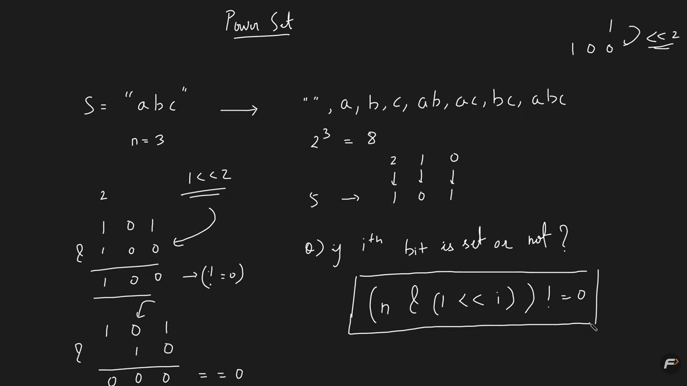

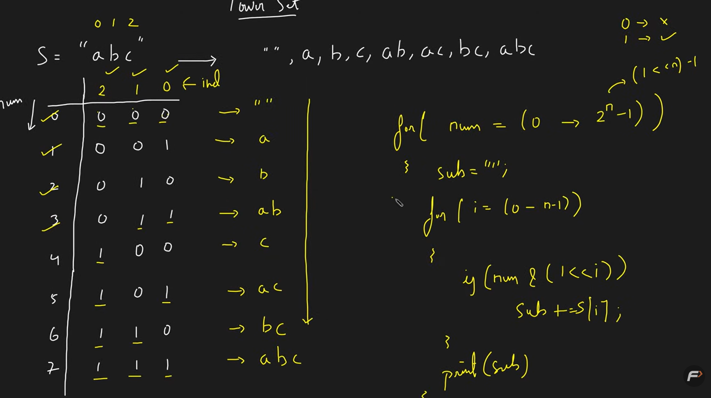

tc
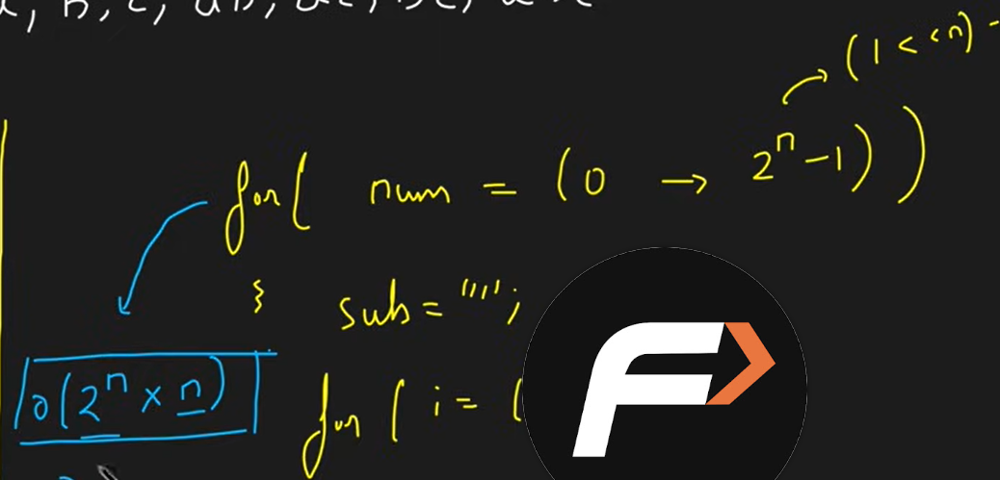

recursive

Use recursion to decide for each character whether to include it or not in the current subsequence. This forms a binary decision tree exploring all combinations.
Start with an empty subsequence. For each character, recursively make a decision.
Either include it in the subsequence or exclude it from the subsequence.
When you reach the end of the string, print the current subsequence.

4_ all patern learn

Learn All Patterns of Subsequences (Theory)

18

What are Subsequences?
A subsequence is a sequence derived from another sequence by deleting some or no elements without changing the order of the remaining elements. Unlike substrings, the elements of a subsequence are not required to occupy consecutive positions in the original sequence.

For example, in the string "abc", the subsequences include: "a", "b", "c", "ab", "ac", "bc", and "abc".

Total Subsequences of a String
For a string of length n, the total number of subsequences (excluding the empty one) is 2ⁿ - 1.

This is because each character has 2 options: either be included or not. Thus, 2 × 2 × ... (n times) = 2ⁿ. We subtract 1 to exclude the empty subsequence if not required.

Subsequence vs Substring
Subsequence	Substring
Can skip characters, but order matters	Must be contiguous
Number of subsequences is 2ⁿ	Number of substrings is n(n+1)/2
"ace" is a subsequence of "abcde"	"abc" is a substring of "abcde"
Patterns and Problems Based on Subsequences
Generate All Subsequences – Basic recursion or backtracking
Count Subsequences with Specific Property – e.g. sum = target
Longest Increasing Subsequence (LIS) – Classic DP problem
Subsequences with K elements – Use recursion with element count
Print all subsequences with sum = K – Variation of subset sum
Recursive Structure for Generating Subsequences
We use the idea of "pick or not pick" for each character in the string or element in the array.

function recurse(index, current):
    if index == n:
        print current
        return
    // Pick the current element
    recurse(index + 1, current + arr[index])
    // Do not pick the current element
    recurse(index + 1, current)
Use Cases in Problem Solving
Subset sum problems
Count/print subsequences with a given sum
Dynamic programming on subsequences (e.g. LIS, LCS, Count Palindromic Subsequences)
Bitmasking based optimizations
Time & Space Complexity
Operation	Time Complexity	Space Complexity
Generate All Subsequences	O(2ⁿ)	O(n)
Check for specific sum	O(2ⁿ)	O(n)
LIS (DP)	O(n²) or O(n log n)	O(n)
Note: Generating all subsequences has exponential complexity. Use it wisely for small n (usually ≤ 20).

Conclusion
Understanding subsequences and the ability to manipulate them through recursion and dynamic programming unlocks solutions to a wide variety of problems. From classic LIS and subset-sum to interview questions on palindromic subsequences, the concept is foundational in problem-solving.

7_combination

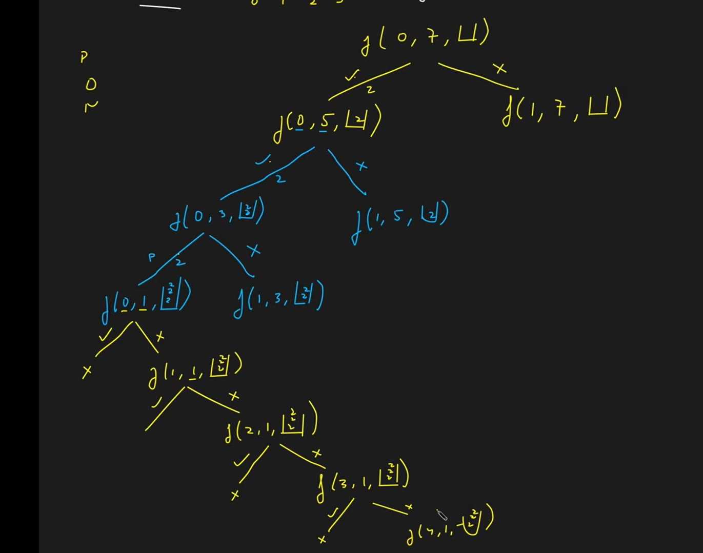
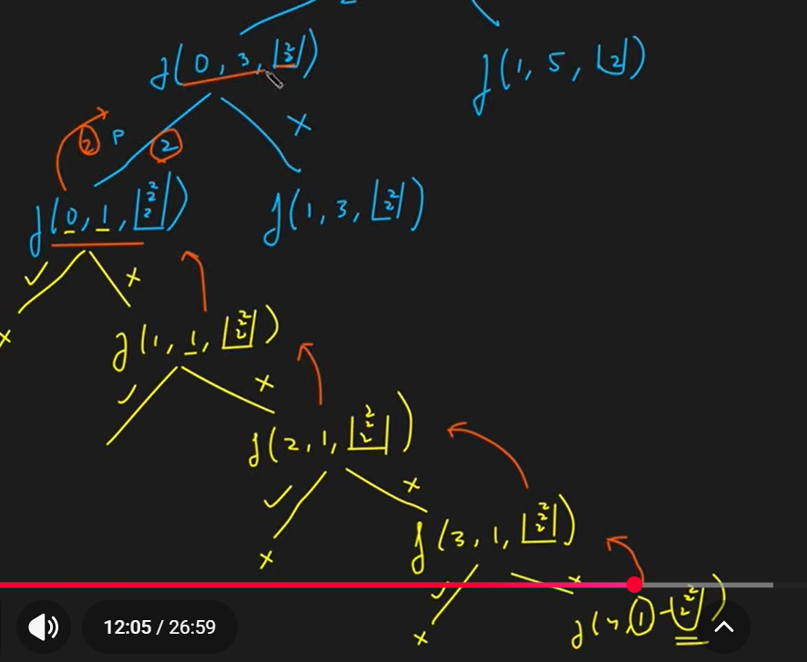

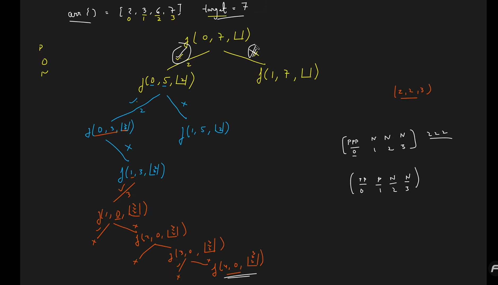

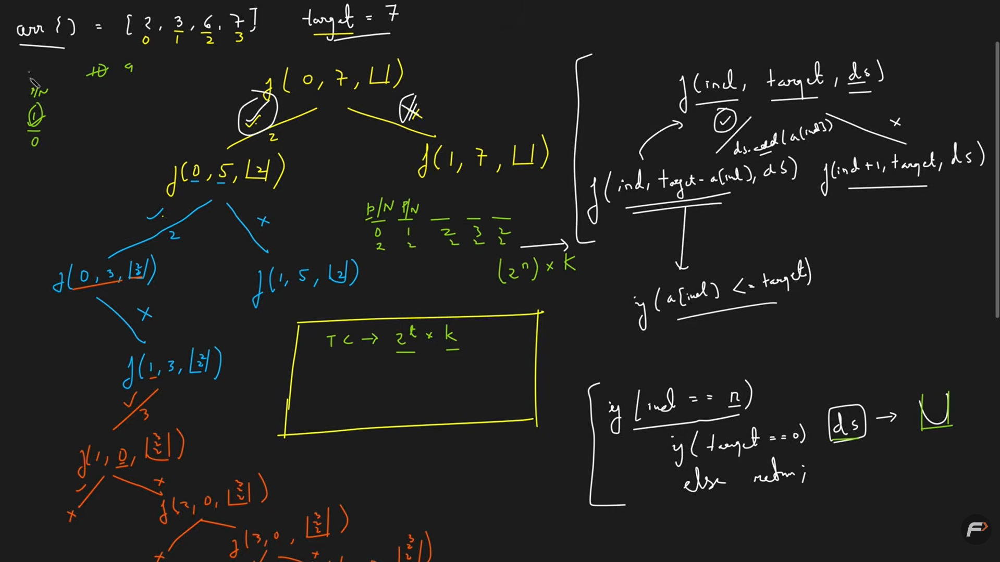

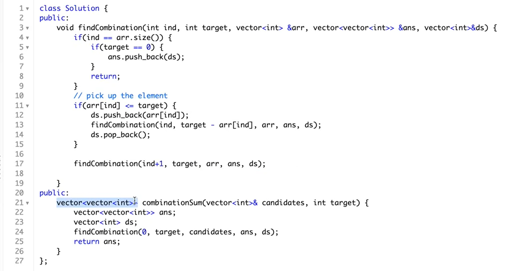

8

brute

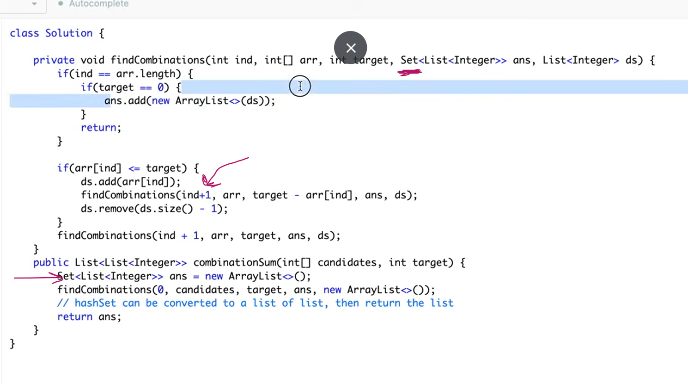

optimal
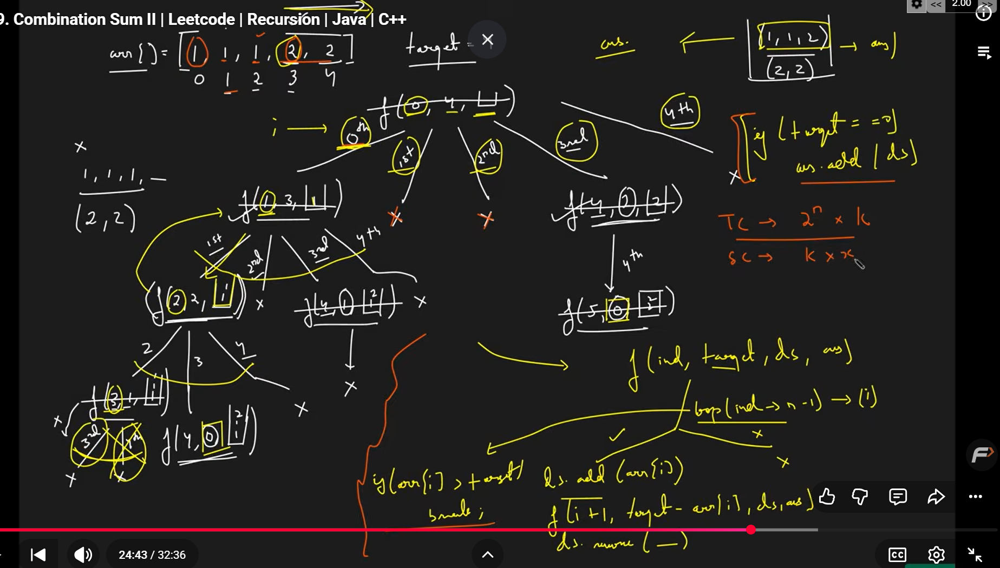
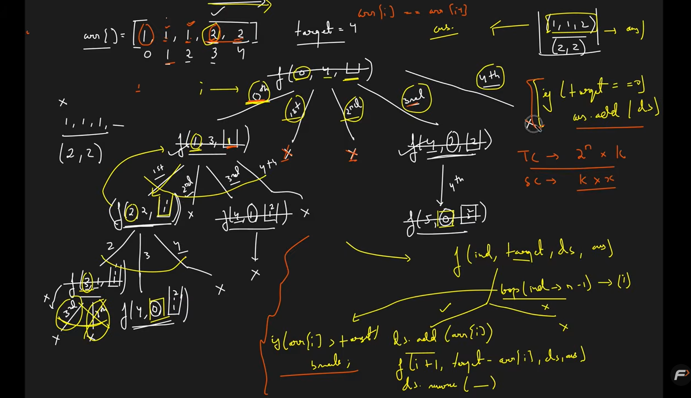
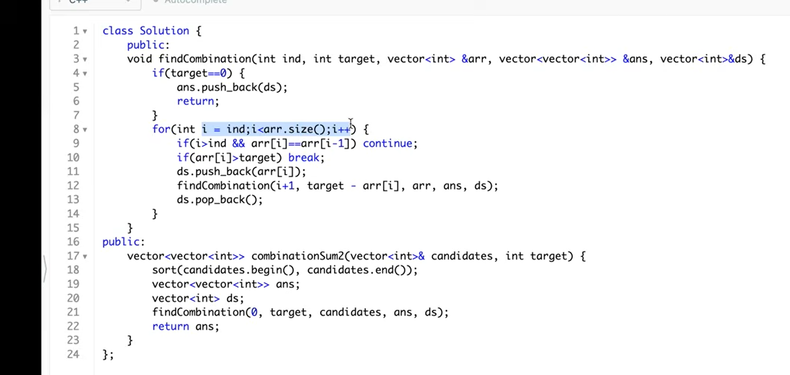