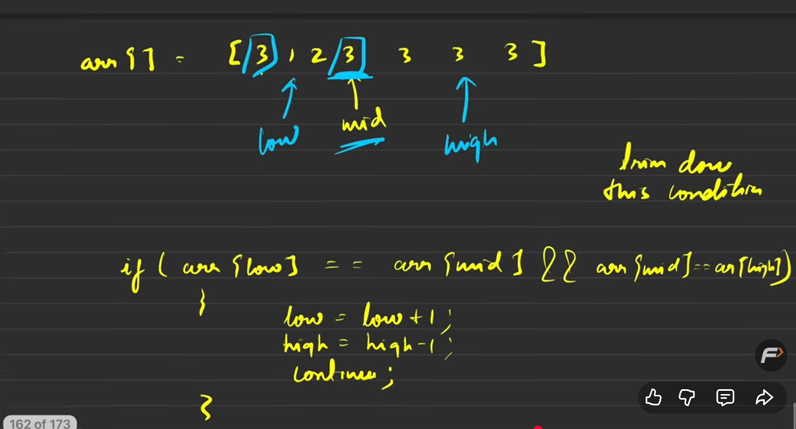
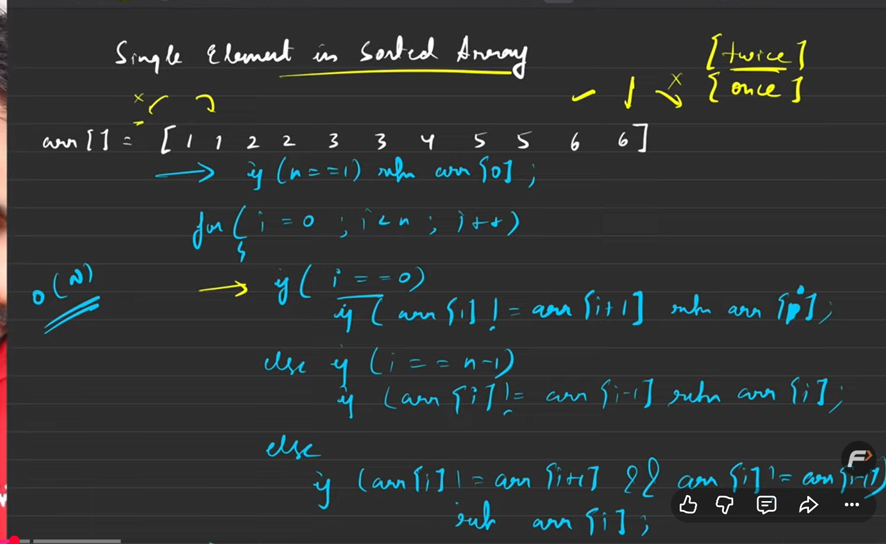
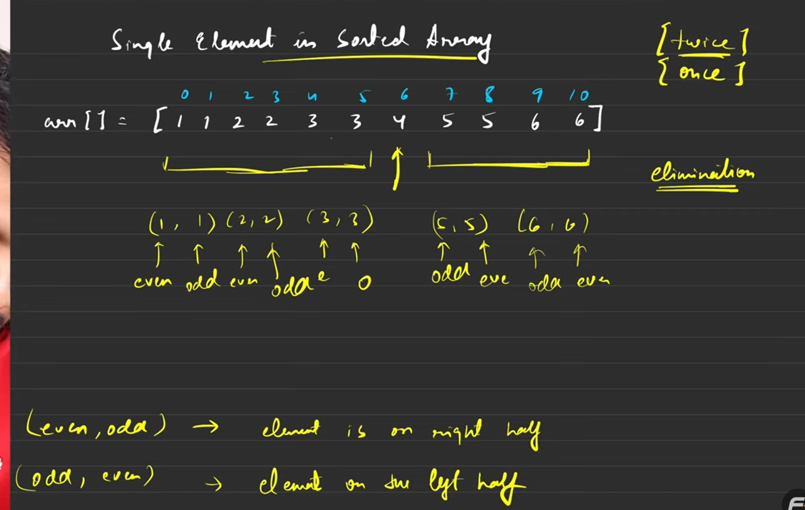
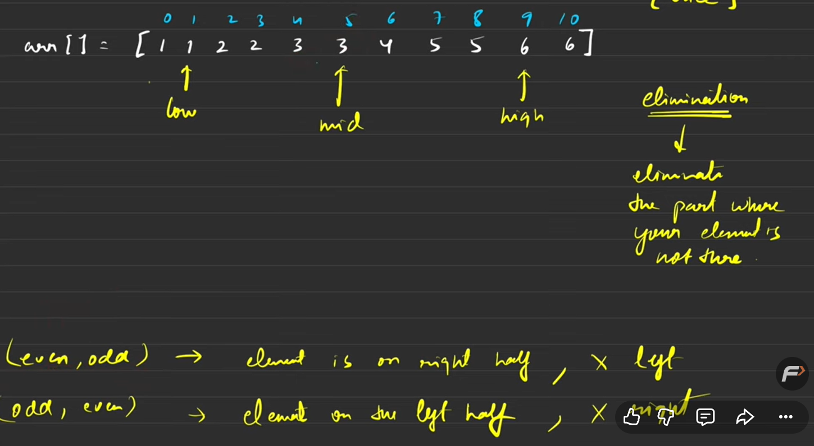
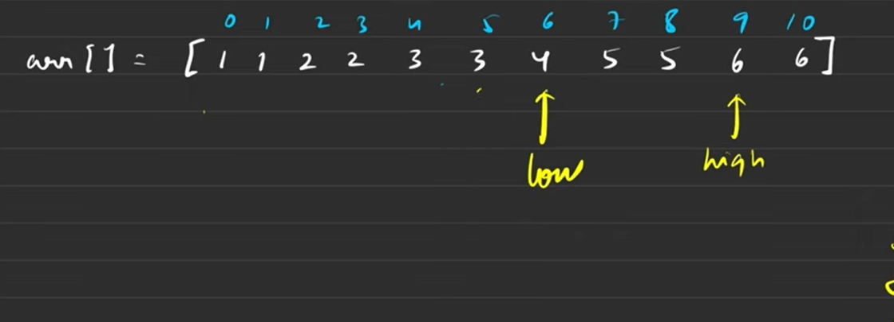
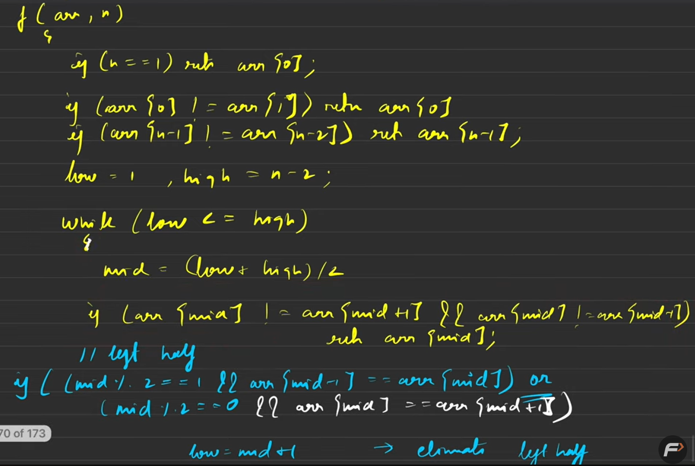
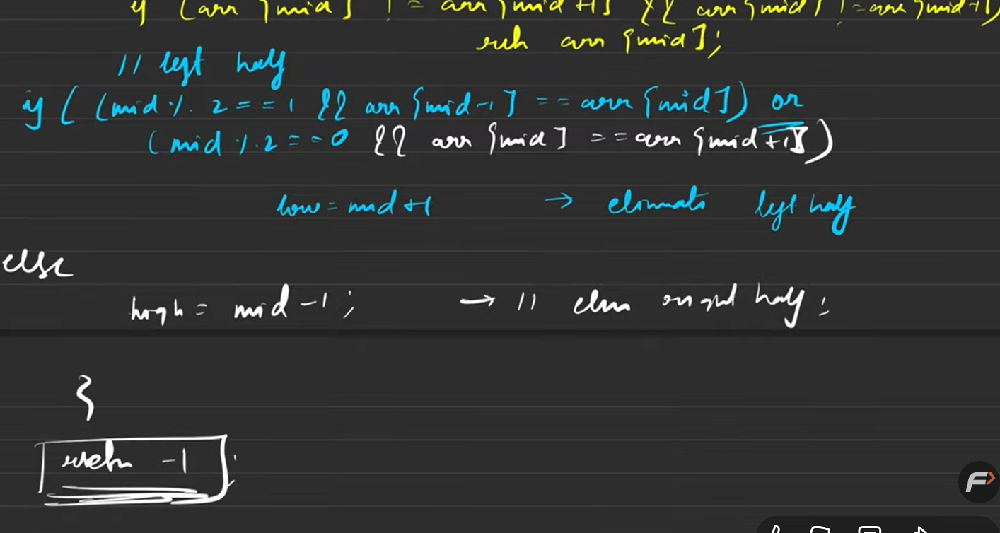

for overflow use mid as long long or this simple math
(2low-low+high)/2 = (low+high)/2

upperbound

occurence brute

FIRST_N_LAST WITHOUT LB AND UB USE BINARY

Is target exist in rotated dublicate array

prb 11 brute

better

for edge case removal low and high are not from laast and first
see left and right of the number  
elminate the half by seeing if odd position is equal to my number elminate right
if even is my number conatin so eleminate the left

