optimal of xor_k

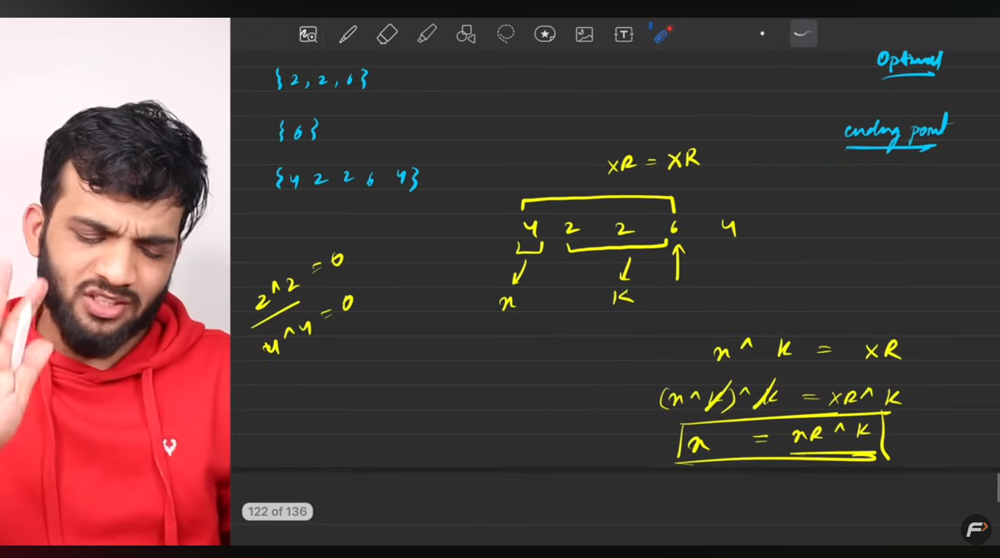

missing

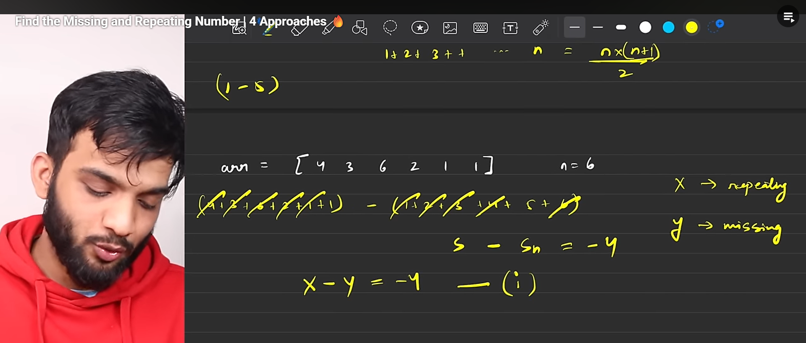

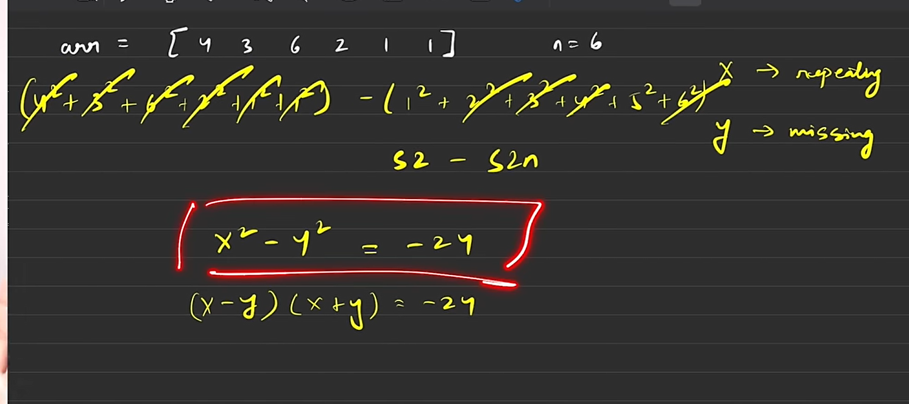

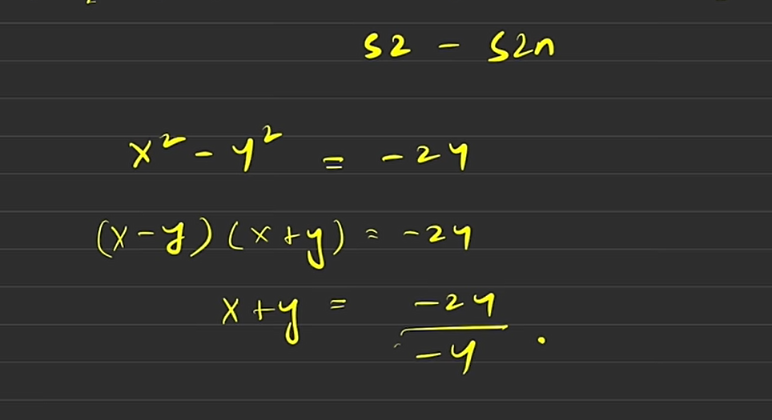

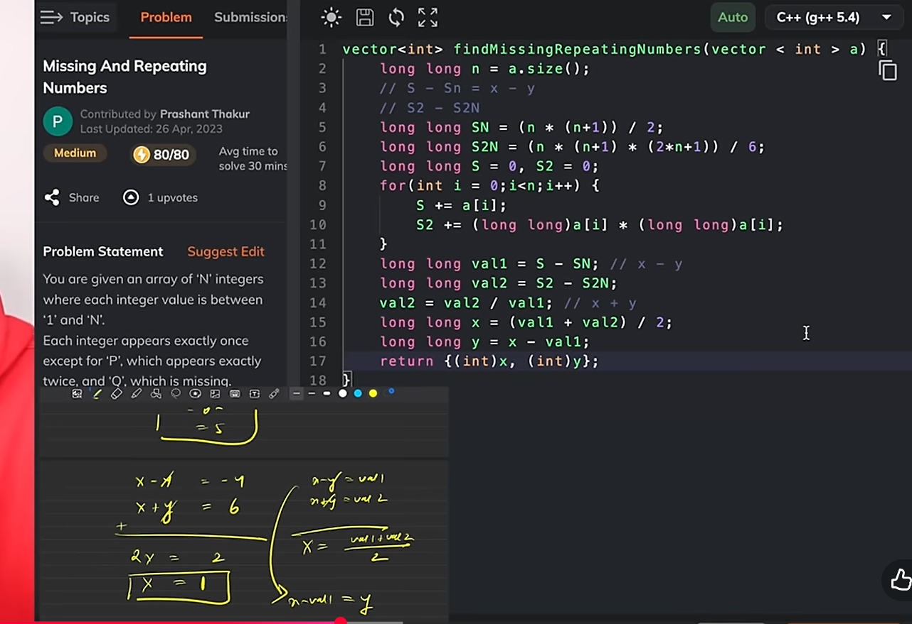

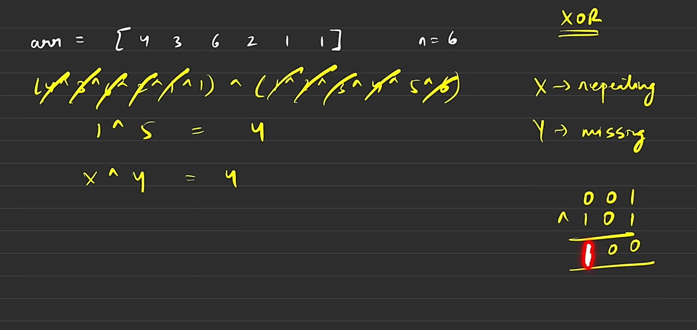

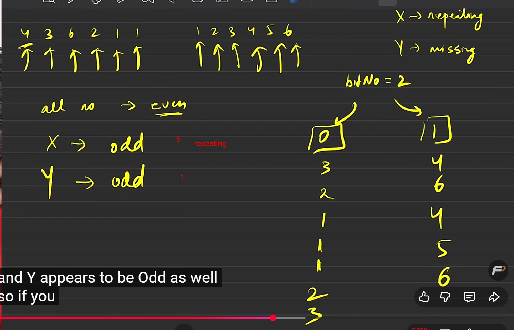

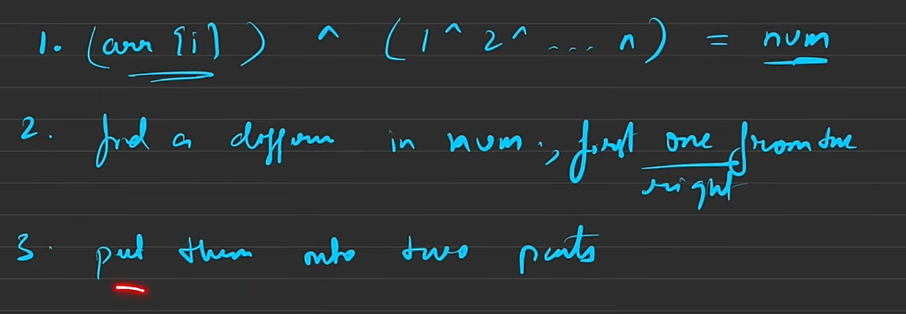

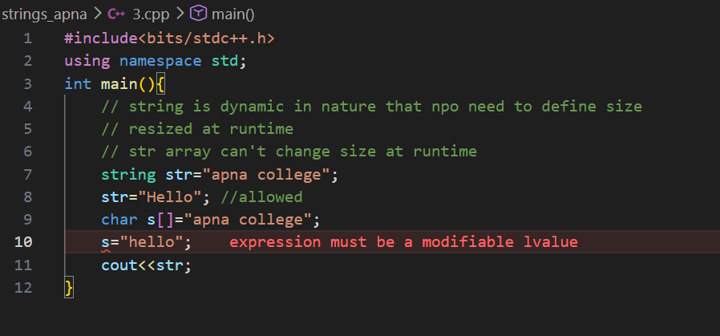

inversin using merge sort
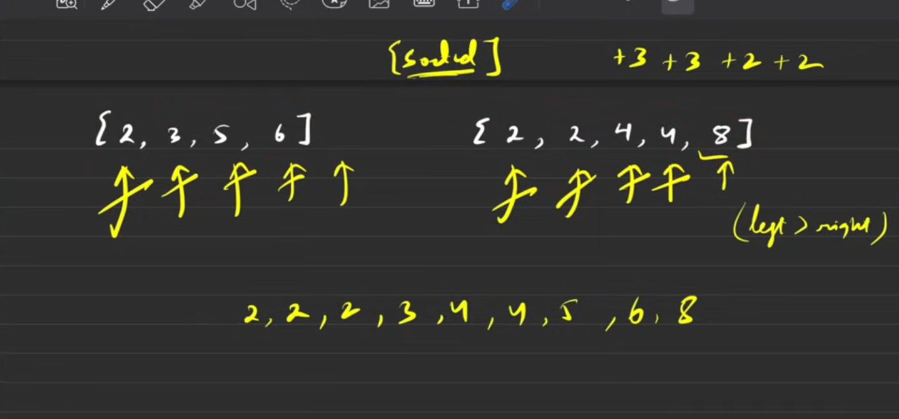

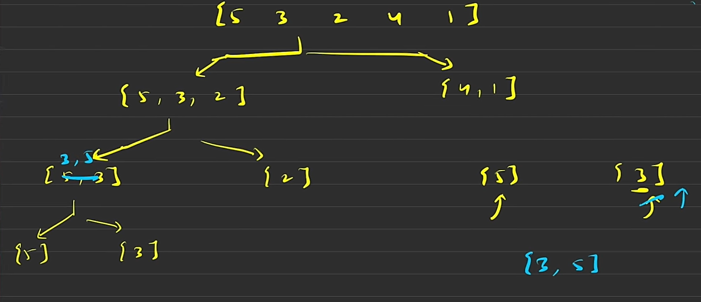

agar left wal akisi ek element se righ t wala choata hua to waha se
left wale full riht wale se se bare haonge bcs sorted
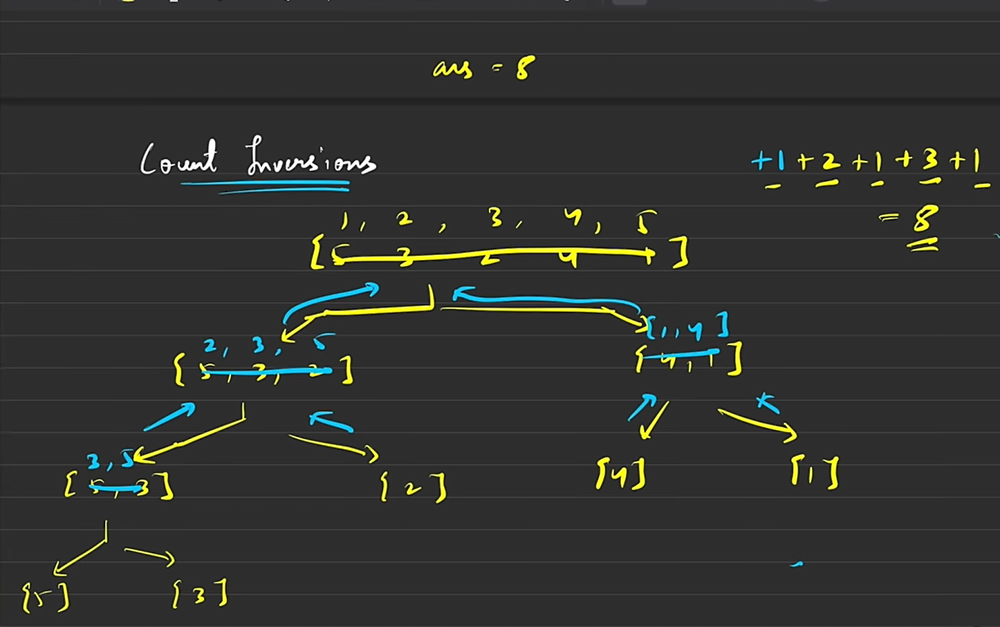

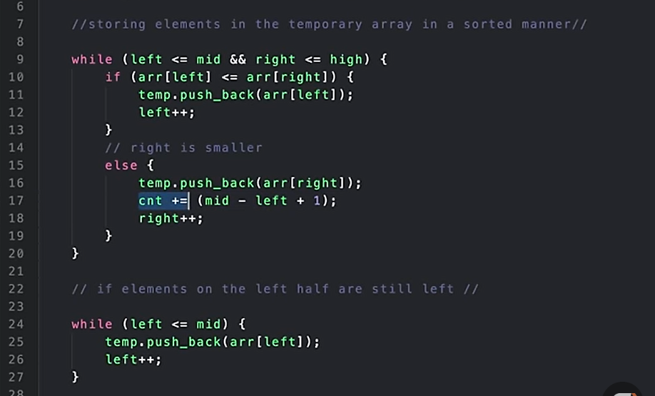
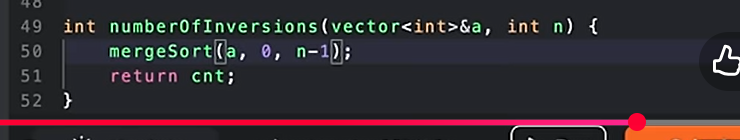

but neede to onlit the c\global variable in real so new code is wriiten instead of this