what is ll

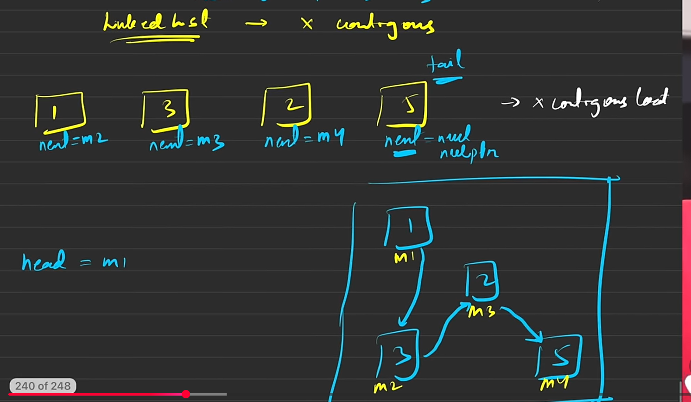

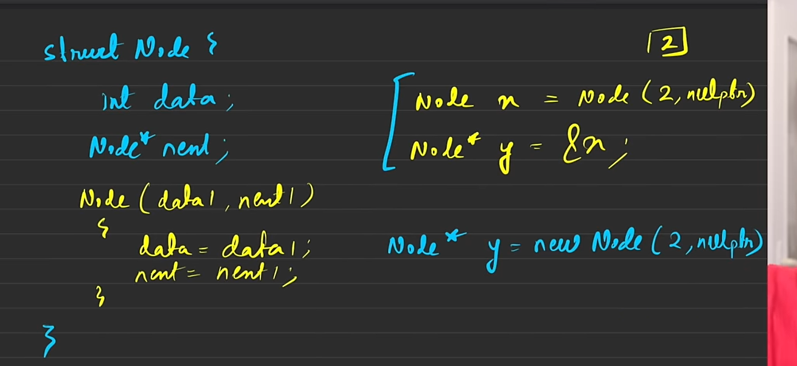

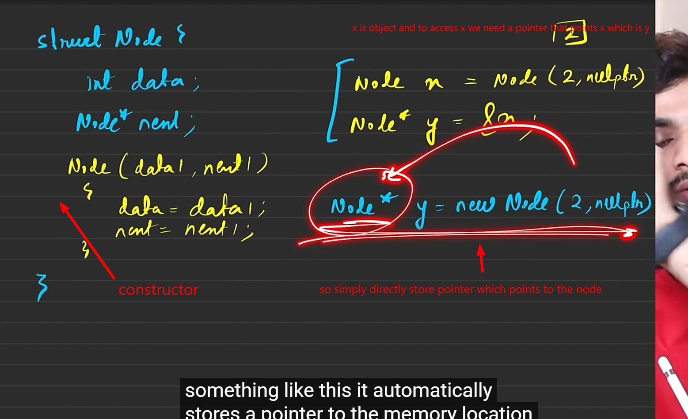

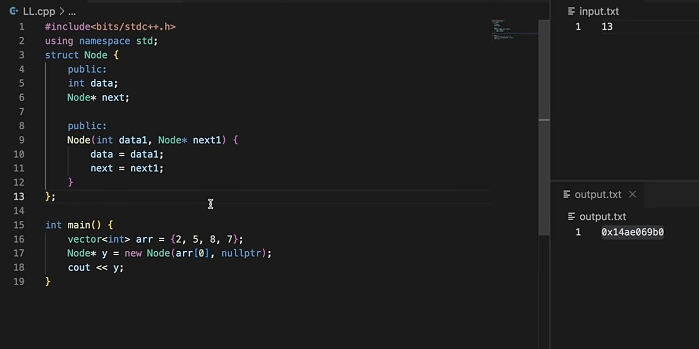

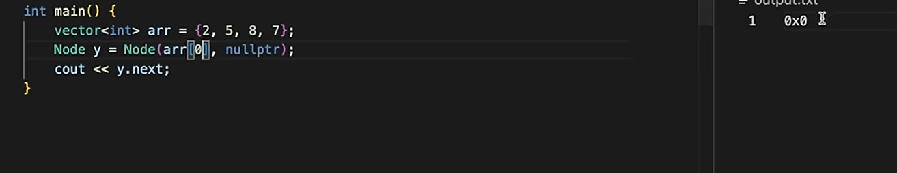

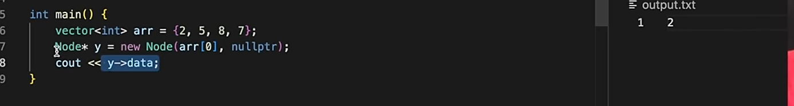

multiple constructor 
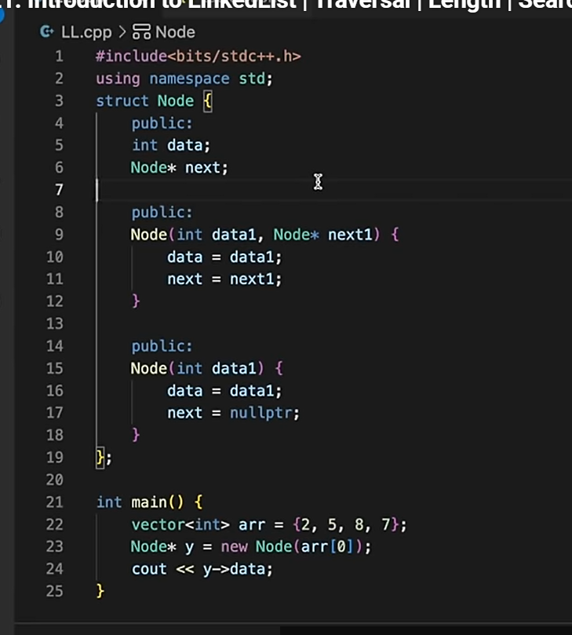
avoiding the  nul passing each time again n again

instead use struct to get oops things
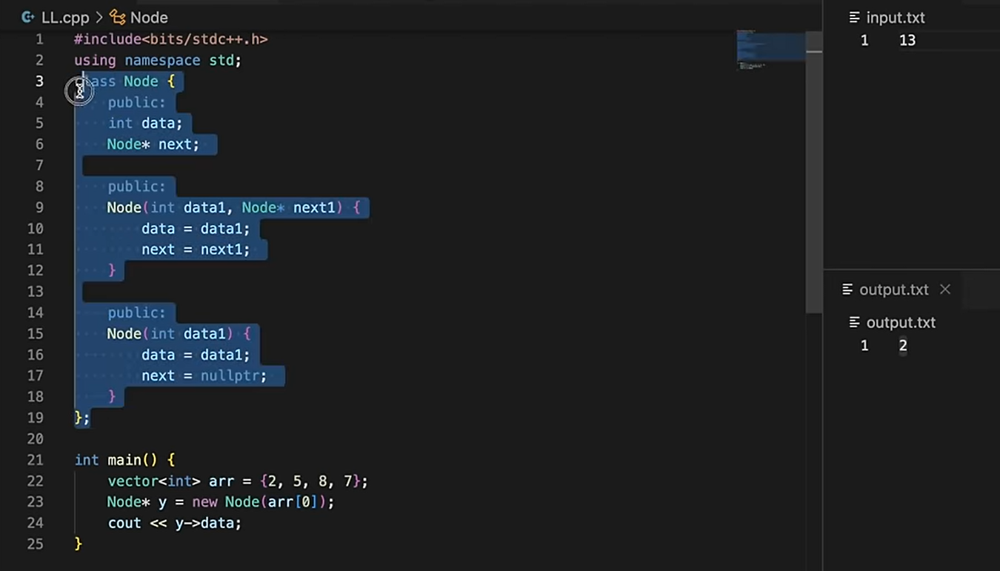

memory
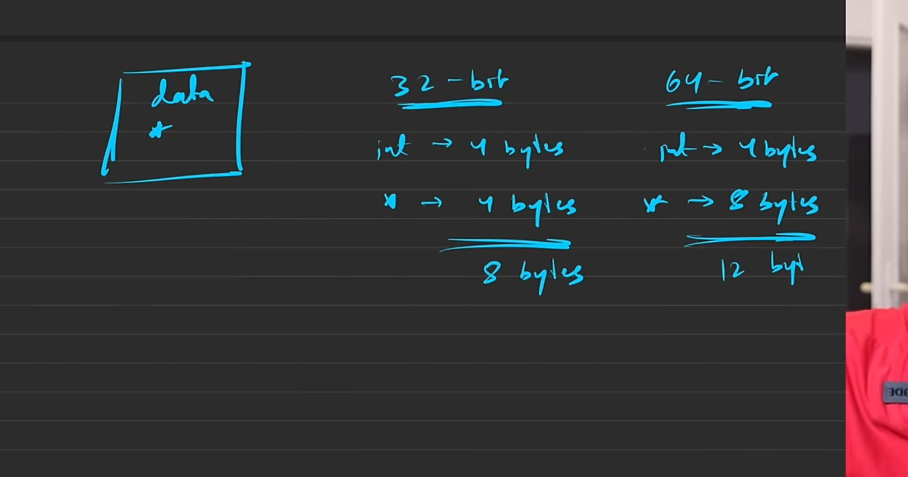

array to link list
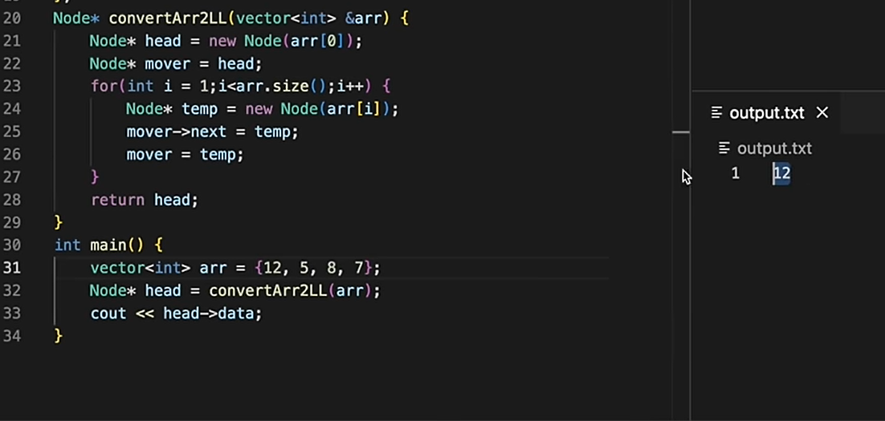

traversal
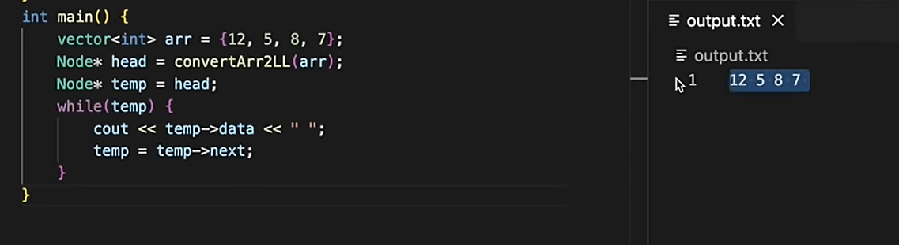

legth of ll
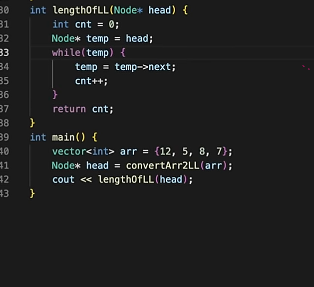

search
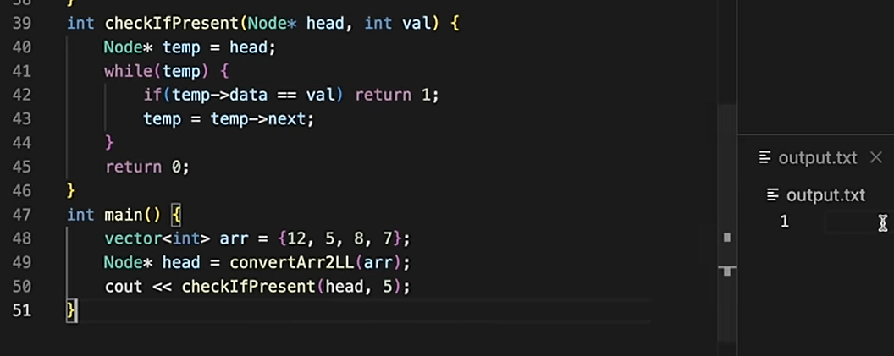

T mean that can be anything pass string, int etc
so to run specify the type
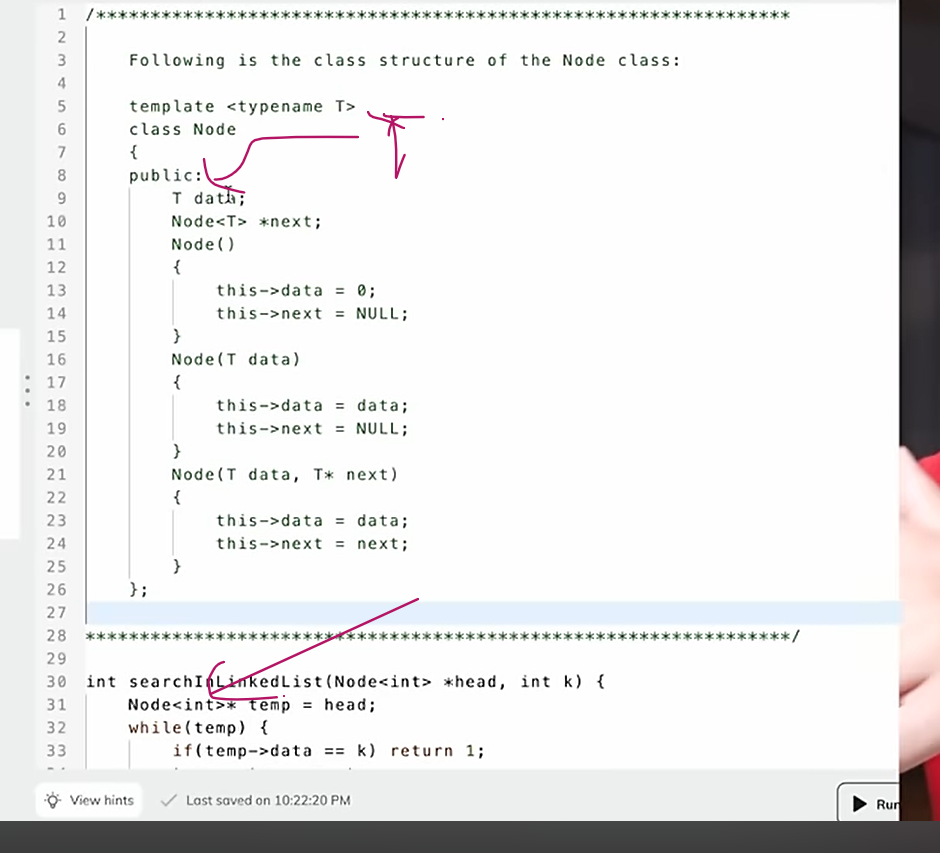

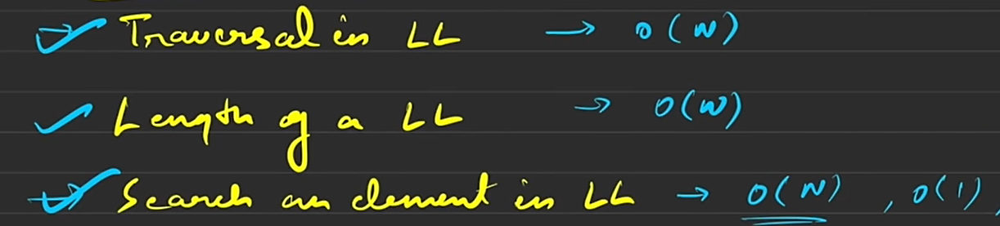