1_bipartite (bfs)

no adjacent have same color

1. if linear always bipartite
2. even cycle bipartite
3. odd cycle can't 

already colored so dont color

4 checked and found its adjacent have same color so its not bp

if not colored then we can color only with opp but if colored then check if opp then ok else no

checking for the components 

2_bp-2

using dfs

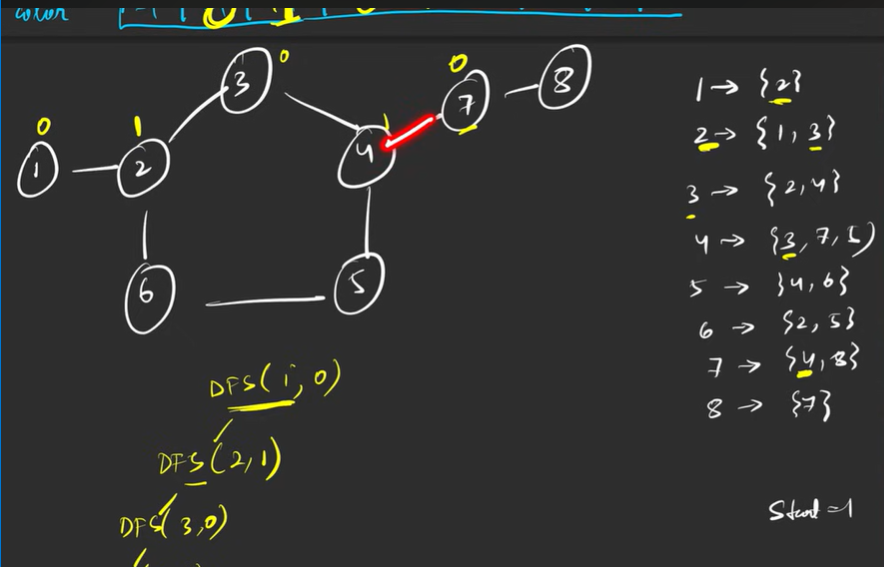

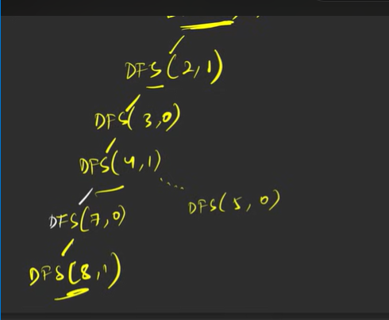

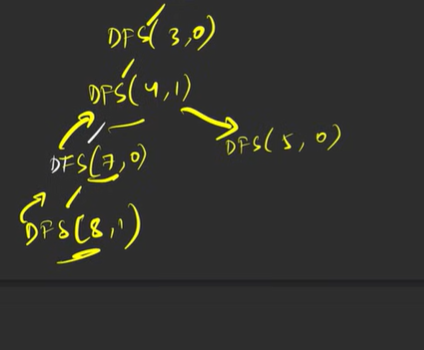

no after returning from 8 go to 5

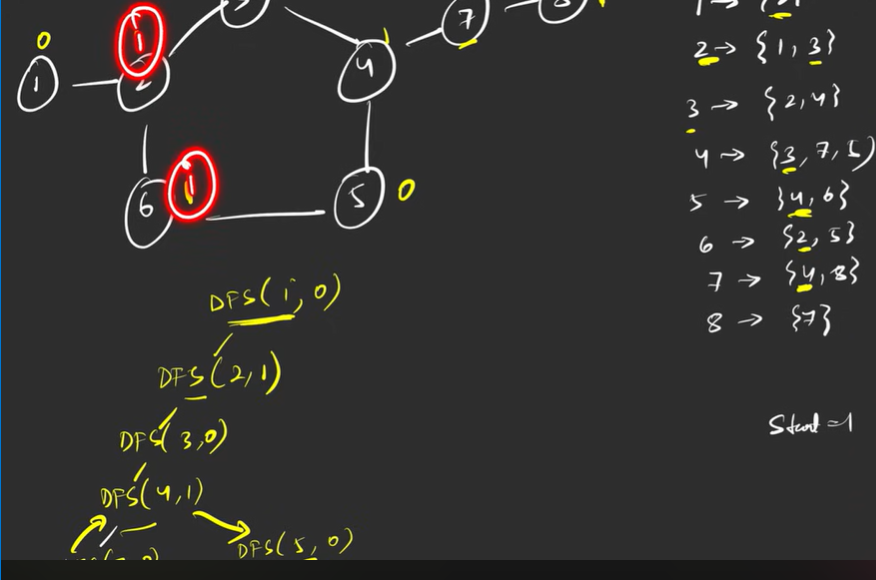

dfs (6) says my adj s\have same of my color so flase

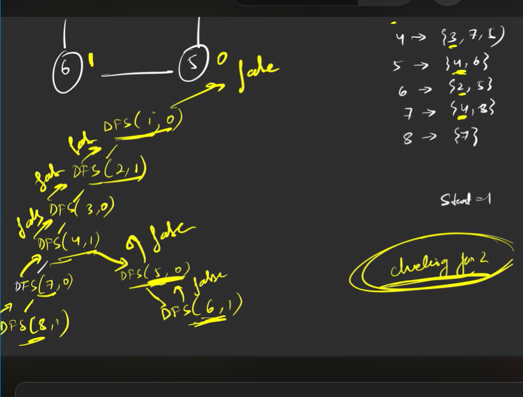

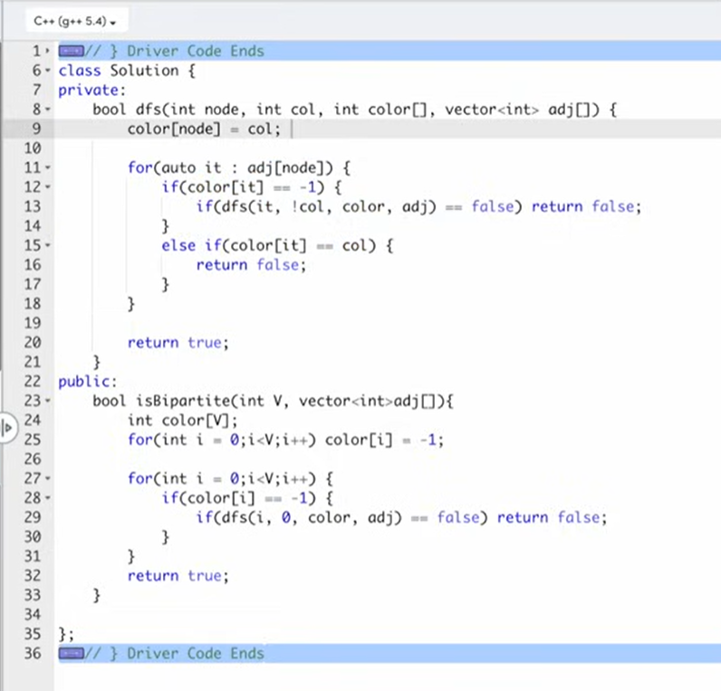

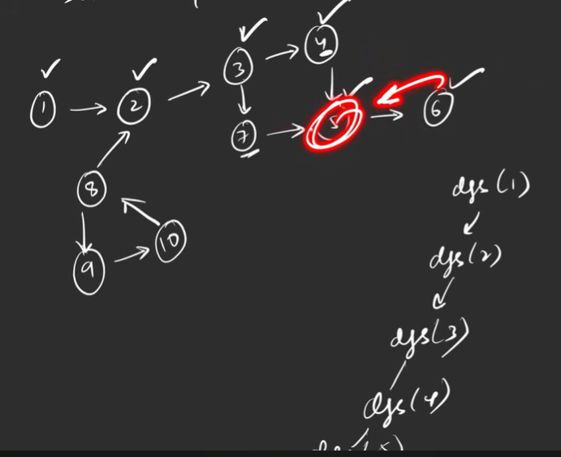

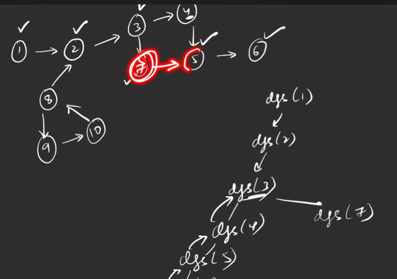

7 found adj visited

but cylce not came in same path 
dfs will failed here

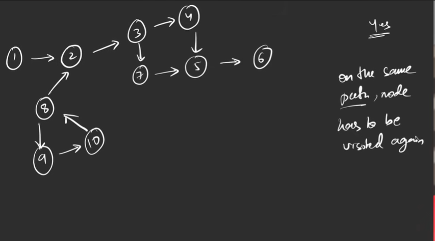

 so use path visited to majke sure it cane to the same path

 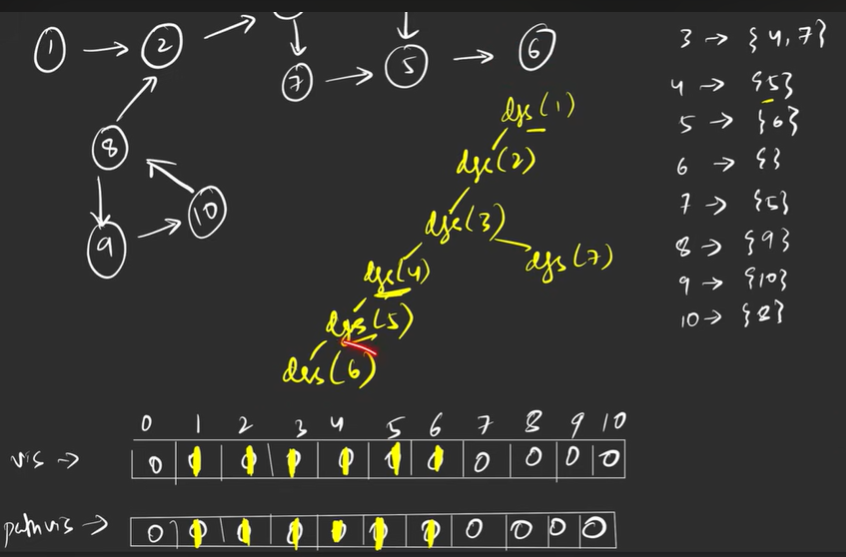

 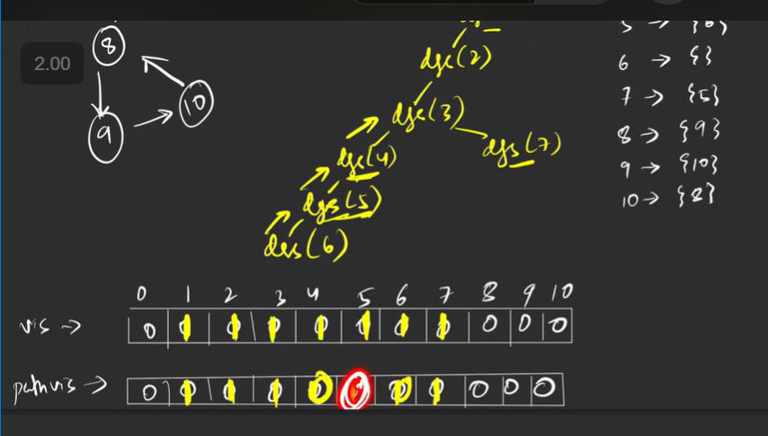

 this time 7 sind 5 visited but not mine path so not a cylce 

 donn't check 5 we have checked
 
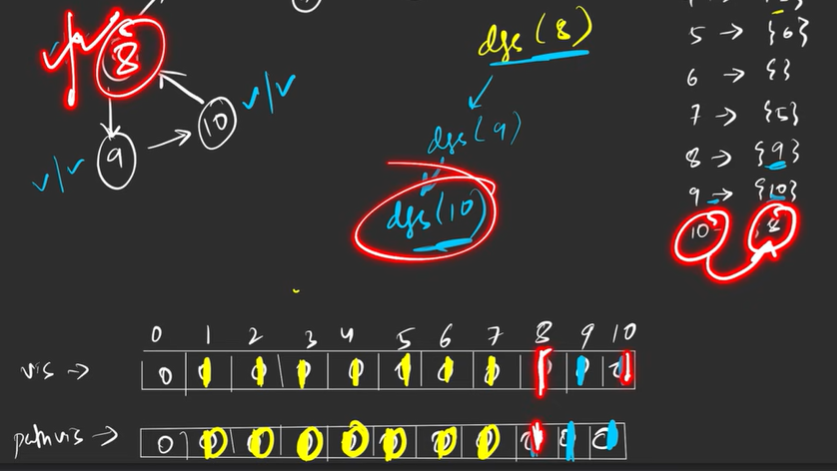

cycle present bcs vis and path vis true

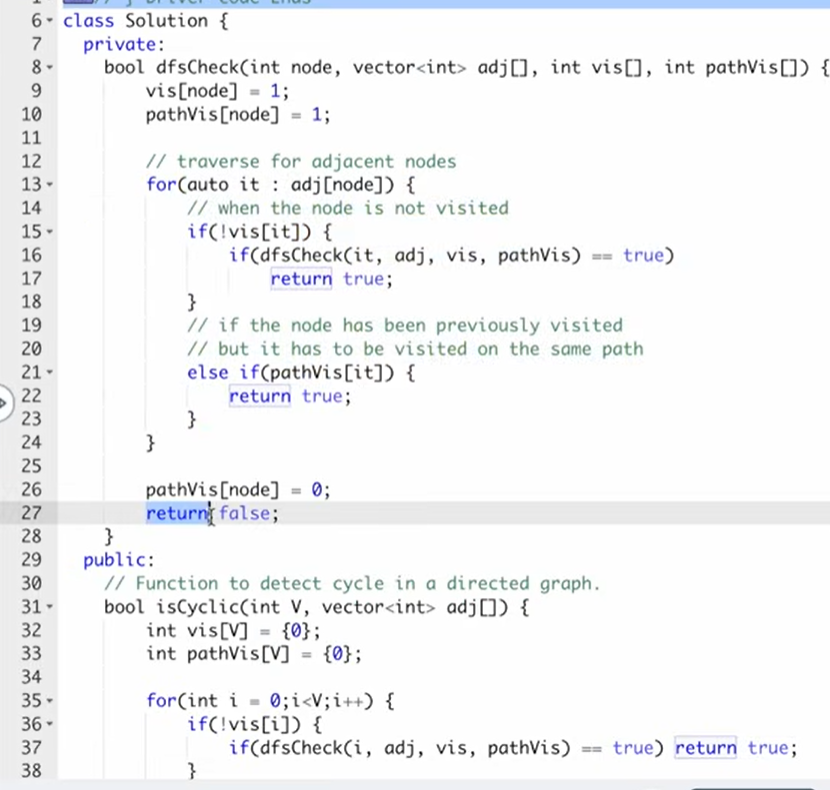

