1_bipartite (bfs)

no adjacent have same color

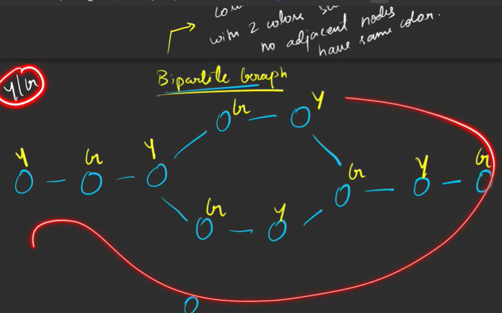

1. if linear always bipartite
2. even cycle bipartite
3. odd cycle can't 

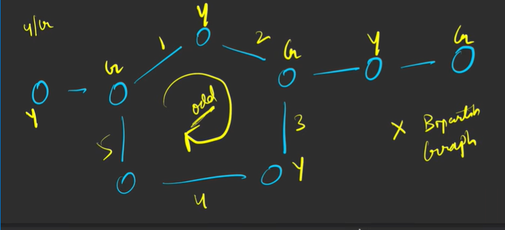

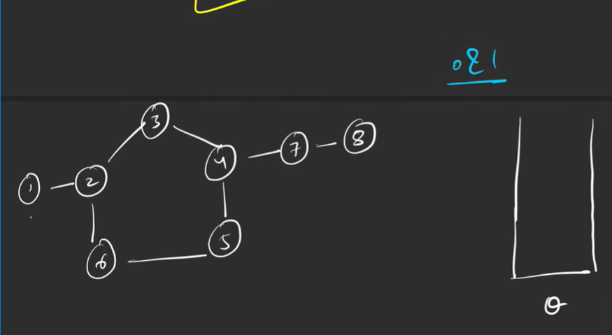
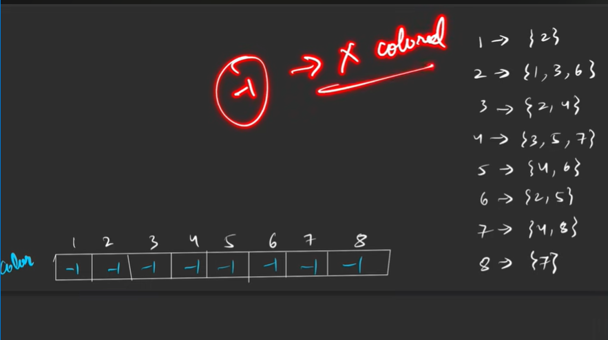

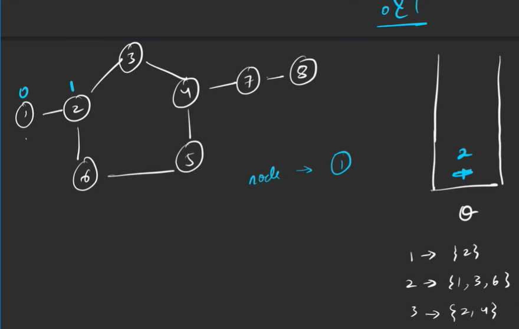

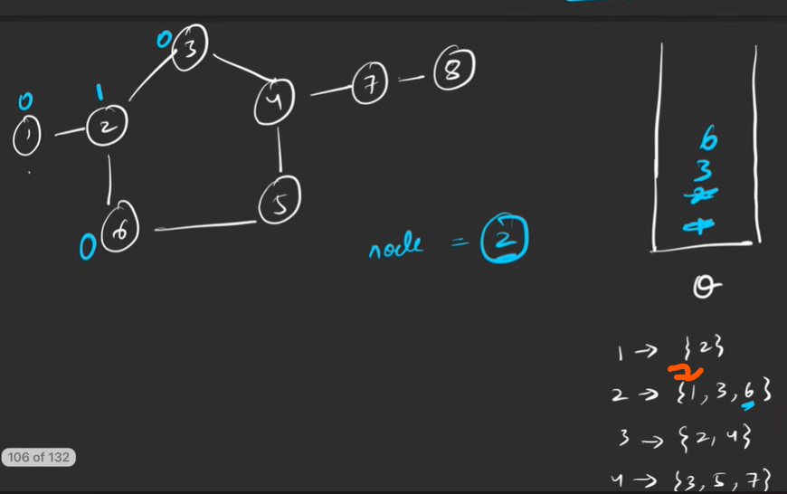
already colored so dont color

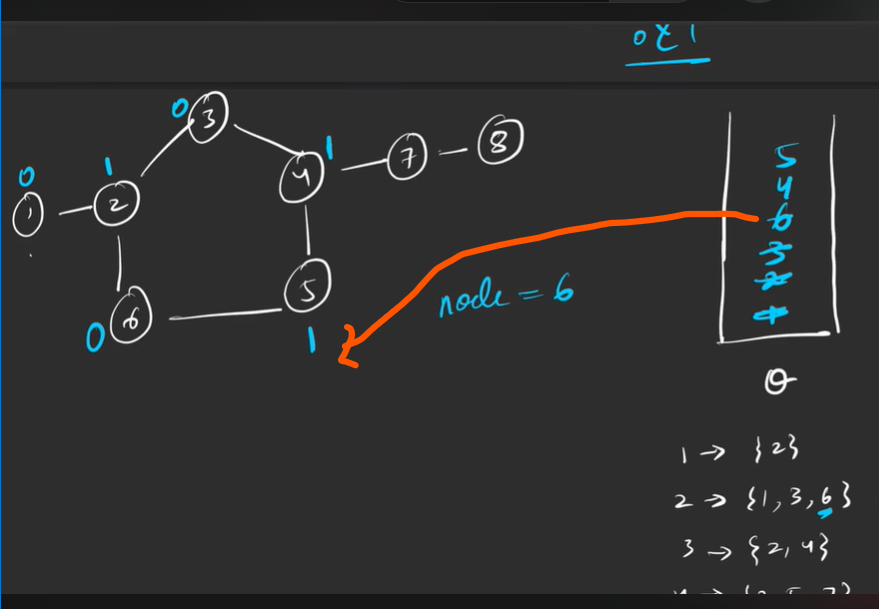

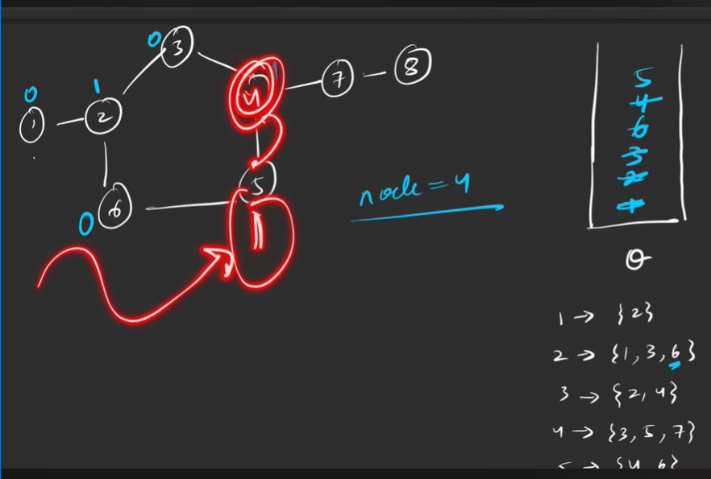

4 checked and found its adjacent have same color so its not bp

if not colored then we can color only with opp but if colored then check if opp then ok else no

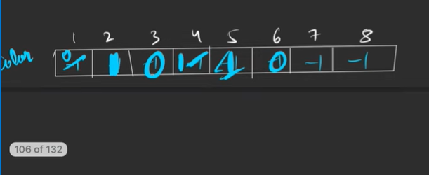

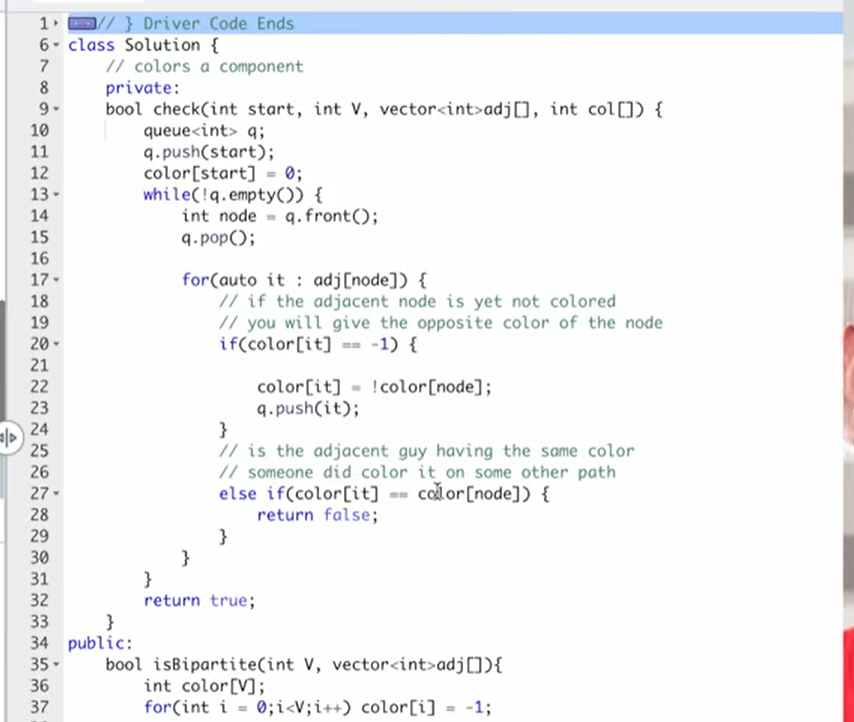
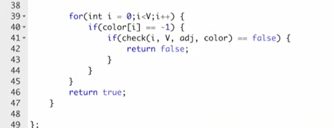

checking for the components 