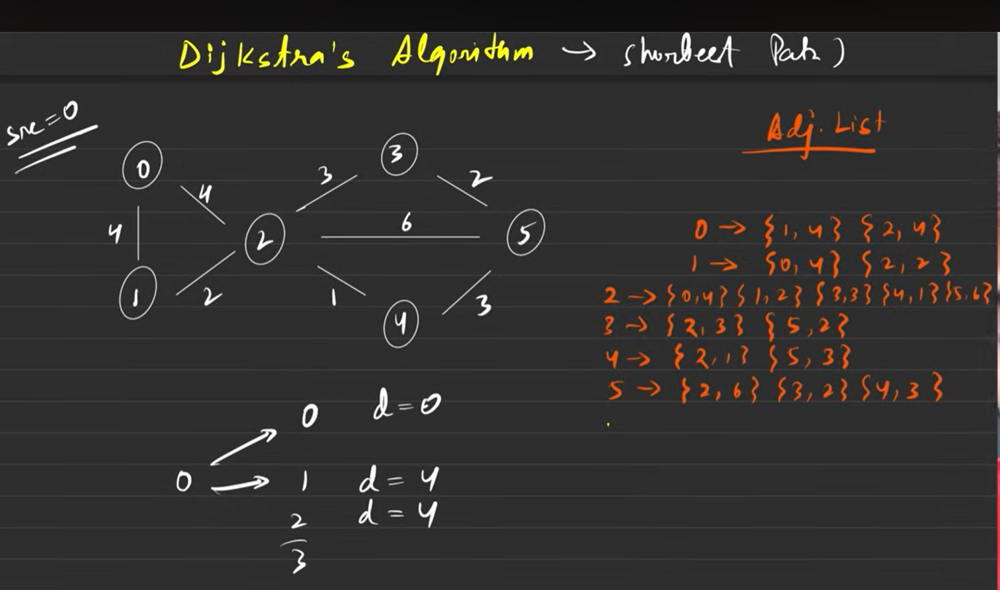
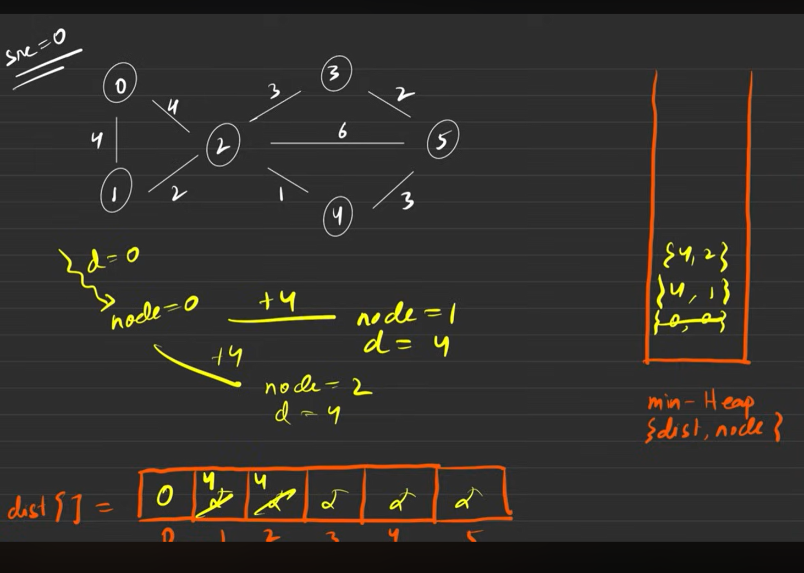
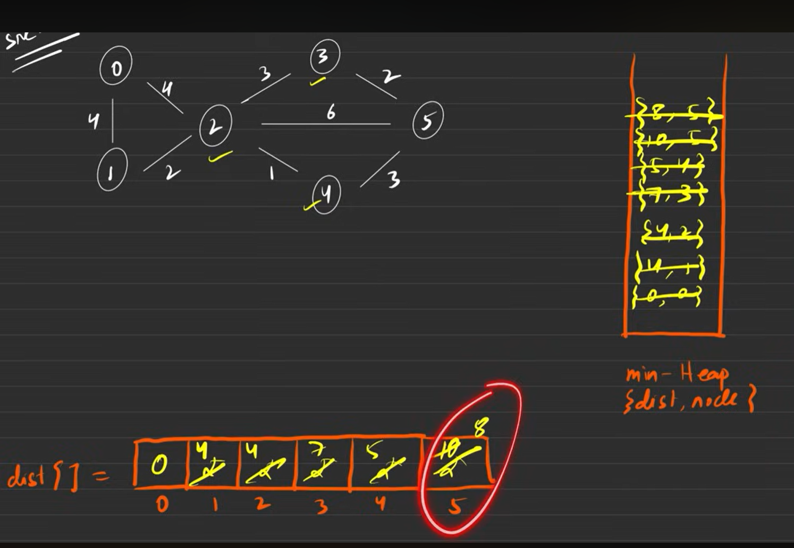
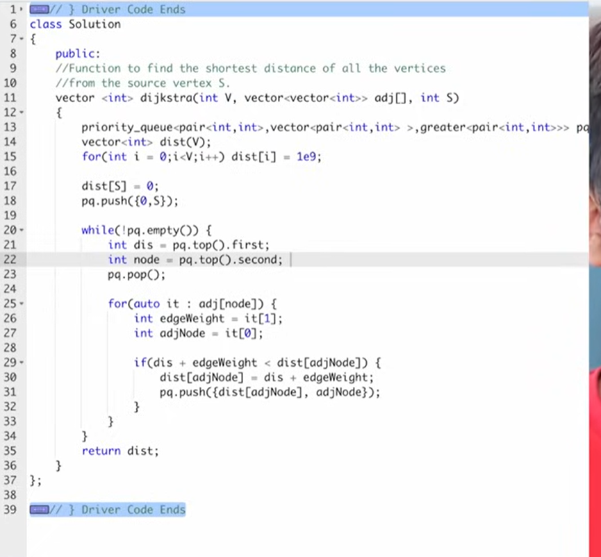
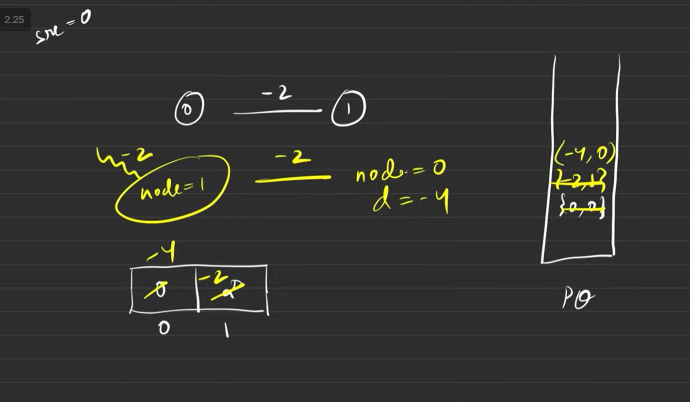
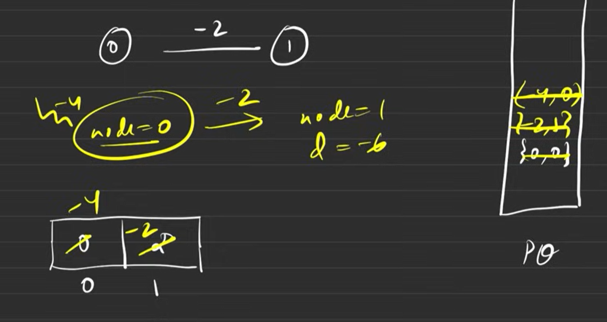
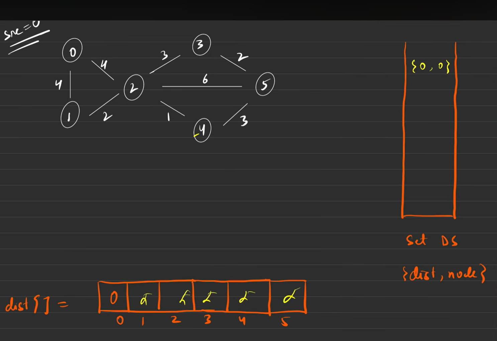
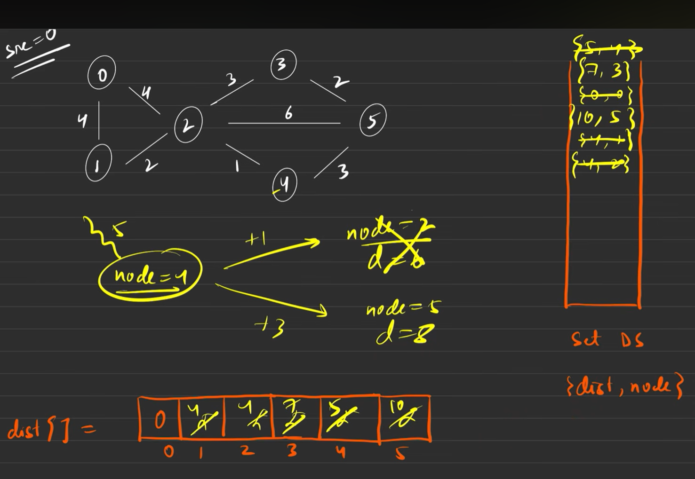
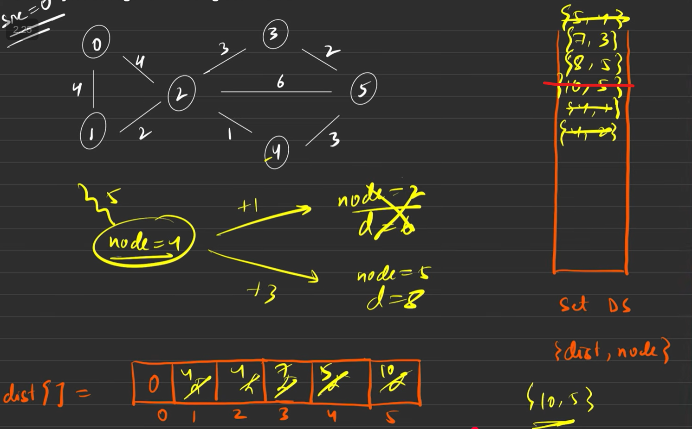
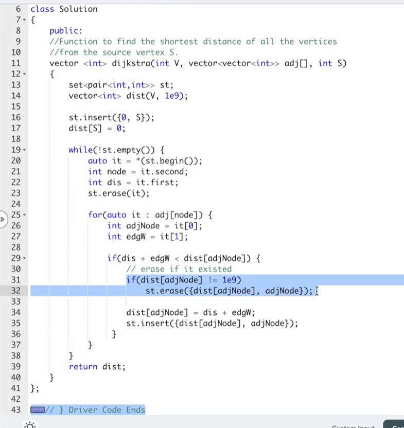

digkistra_1 (with postive cycle only)
using priority queue

why can t with -ve wt

0->1=-2
1->0 = -4
and now so on

2_dig

set store in unique and in ASCENDING ORDER

better so erase the 10,5

erase take long time in set
