1_long_substr

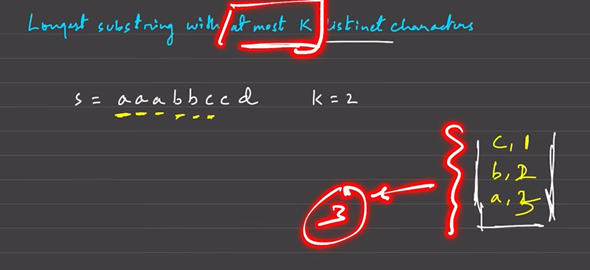

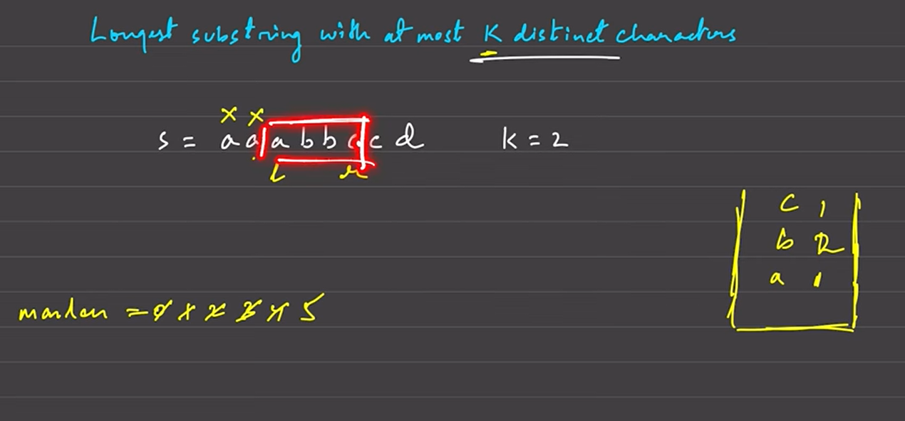
still invalid

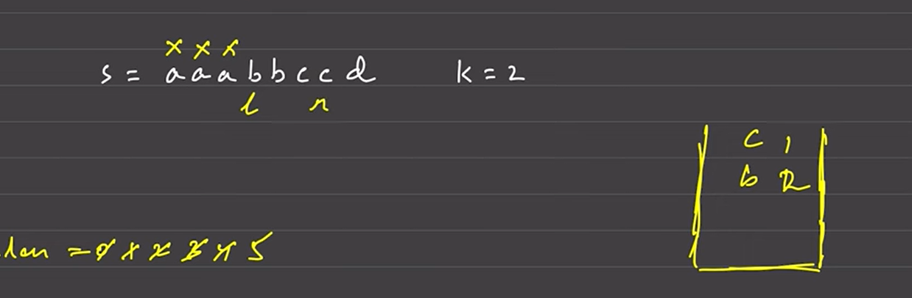
valid move further
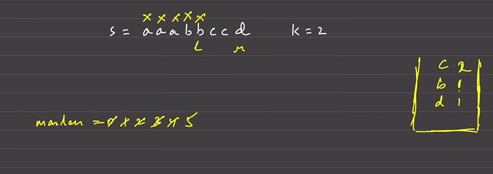
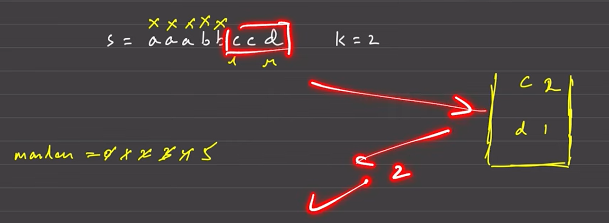

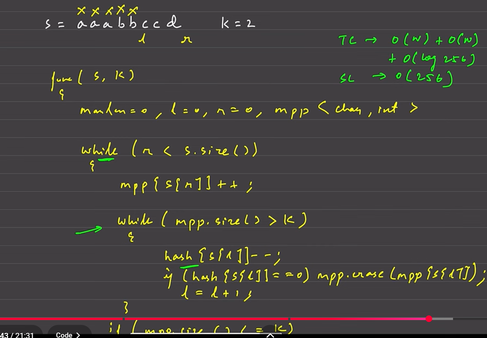
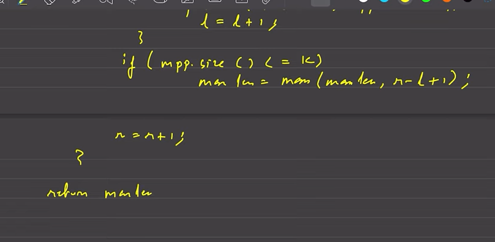

optimizing till O(n)

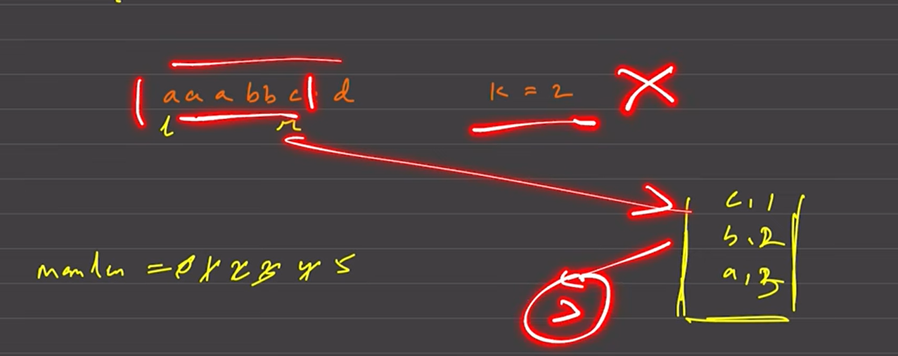
earlier
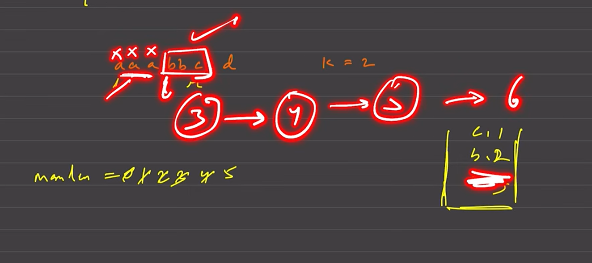

now
remove 1 a keep it len 5
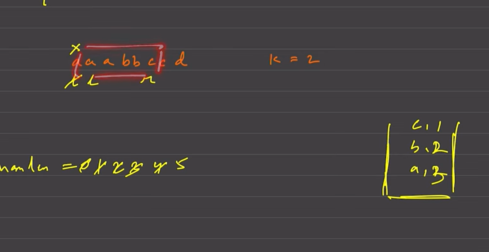
checked for len 6
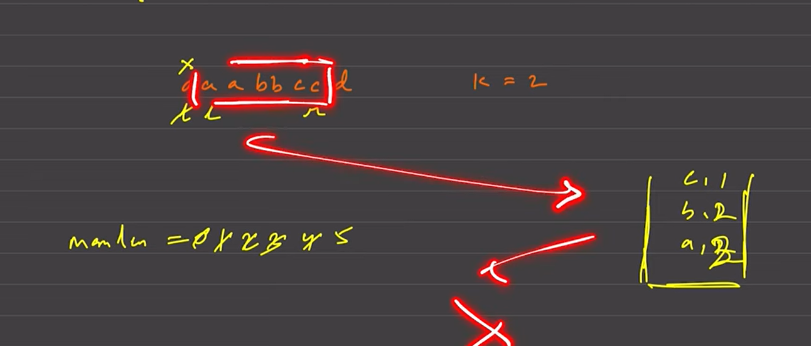
but not correct so 
now again remove 1 a and go 1 step more to maintain 6 ie more than the maxlen found till now
just to think c instead of d for now to understand
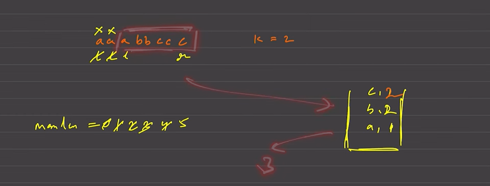
not valid bcs len 3
remove 1 a
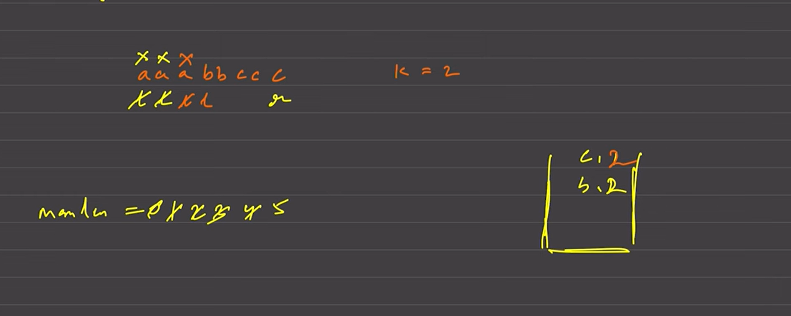
inc r let more c was there so we get len 6
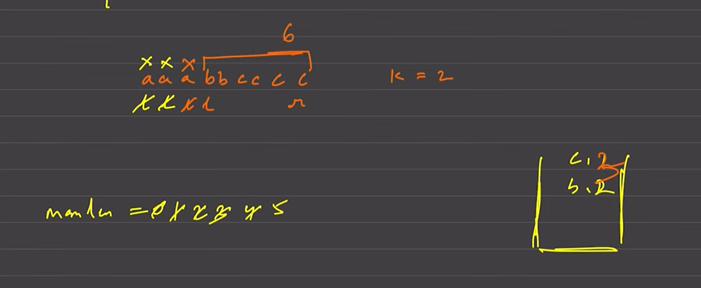

concl: not allowed to mive beyonf\d 5 until valid
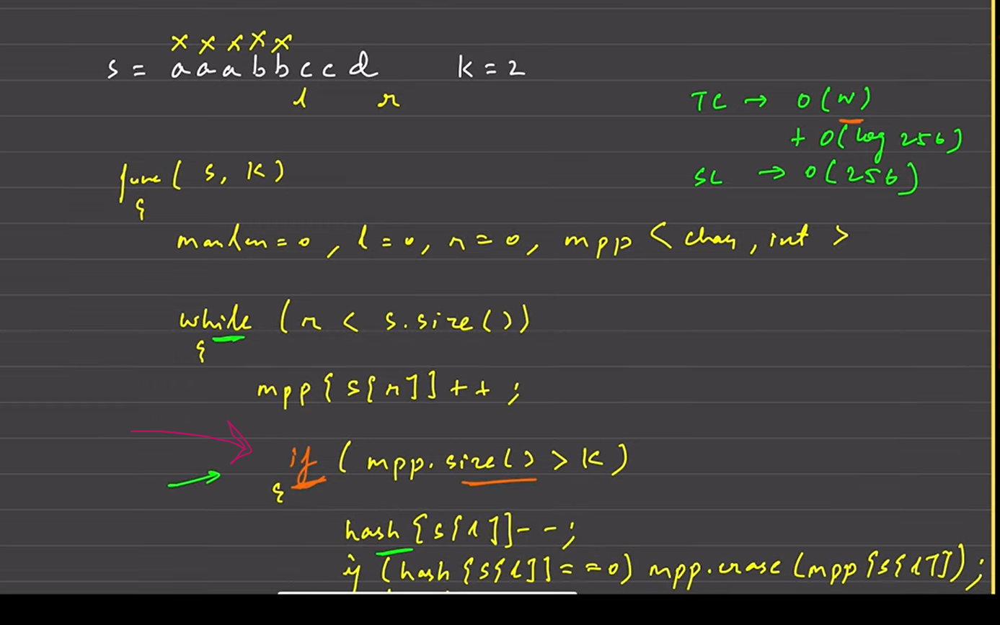
most optimized  