1_sliding

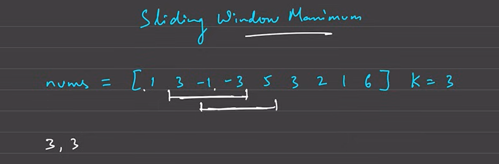

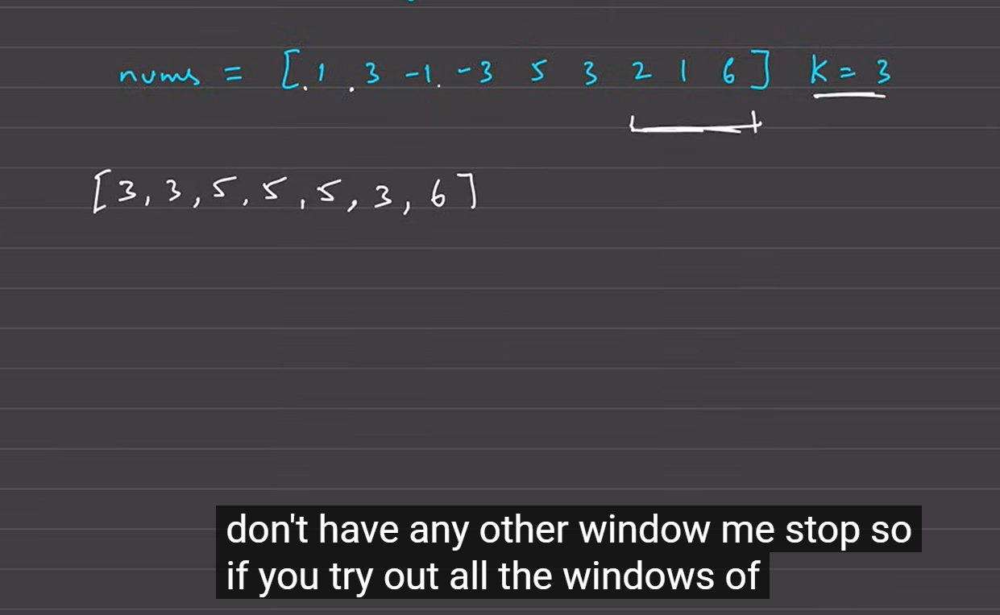

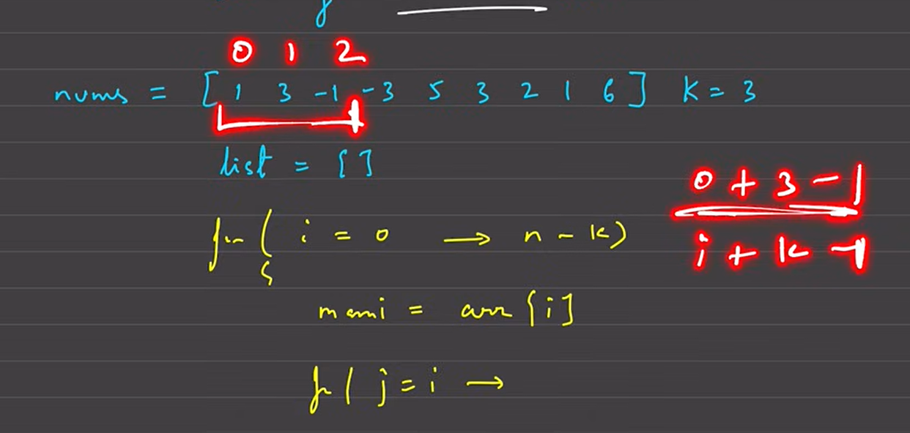

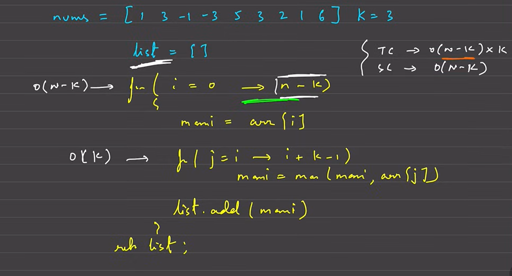

aage wale ko dalo if size>so peeche wale ko hataao
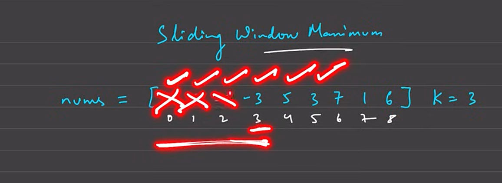

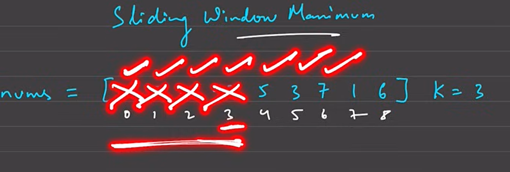

optimal

so i need the ds that inset and delete 
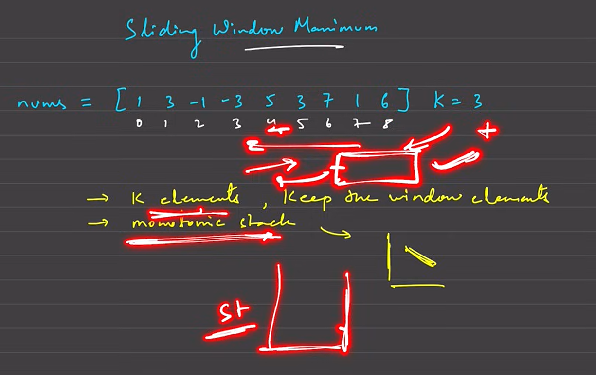
and dec oder -> monotonic stack

use double ended queue

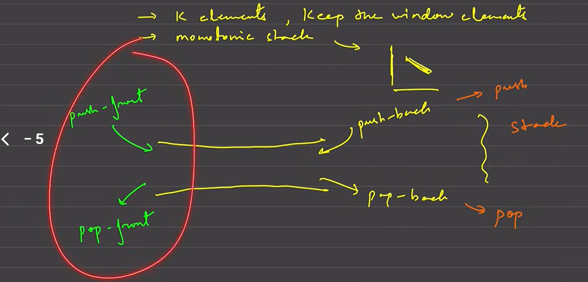

we have size k to store k elements in this but
we need to maintain dec order too so no mean to store 1 when 3 comees
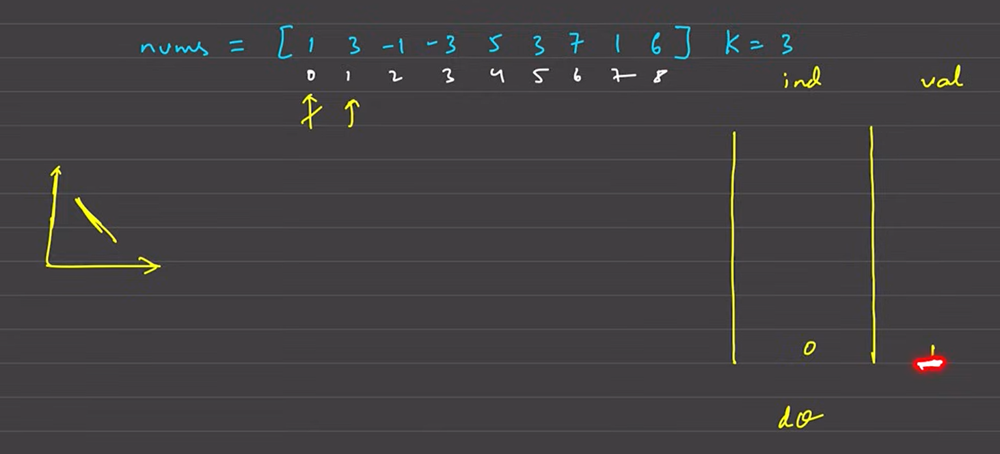

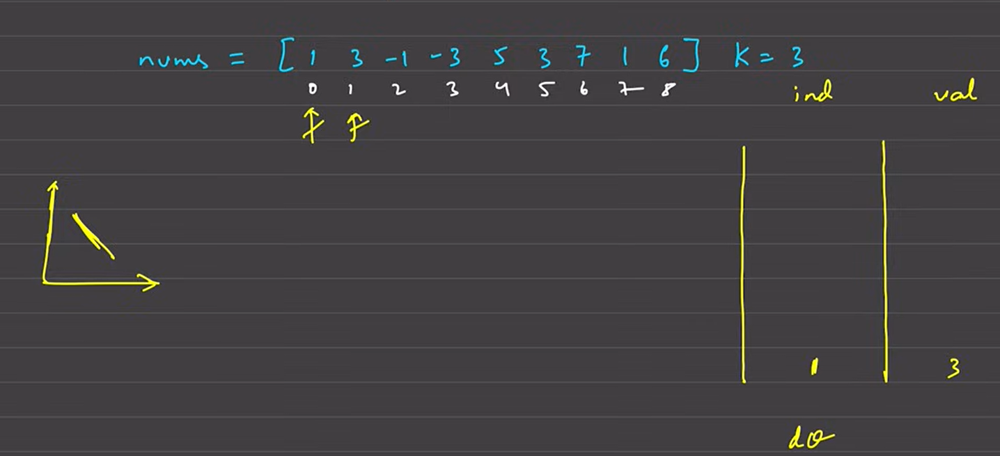

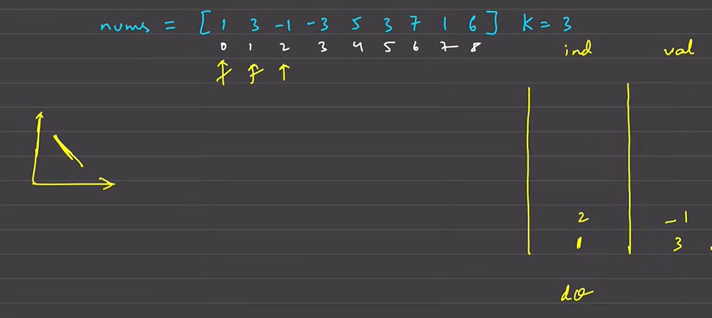

we are storing -1 bcs if window size>k so may be 3 need to go out of queue
and may be at that time -1 will be my max so i need to store -1

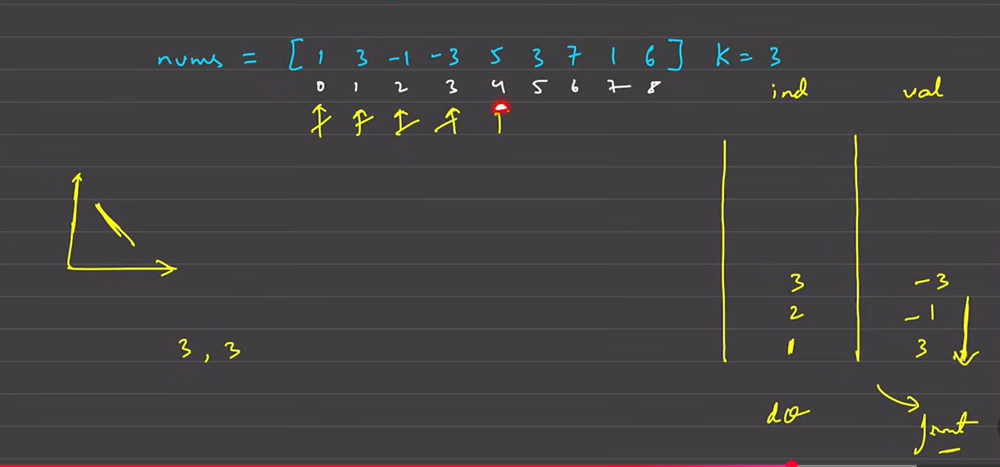

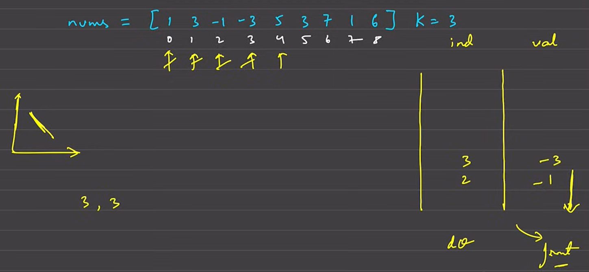

bcs of k=3 first was poped 

now next element is 5 and other were less so pop them too
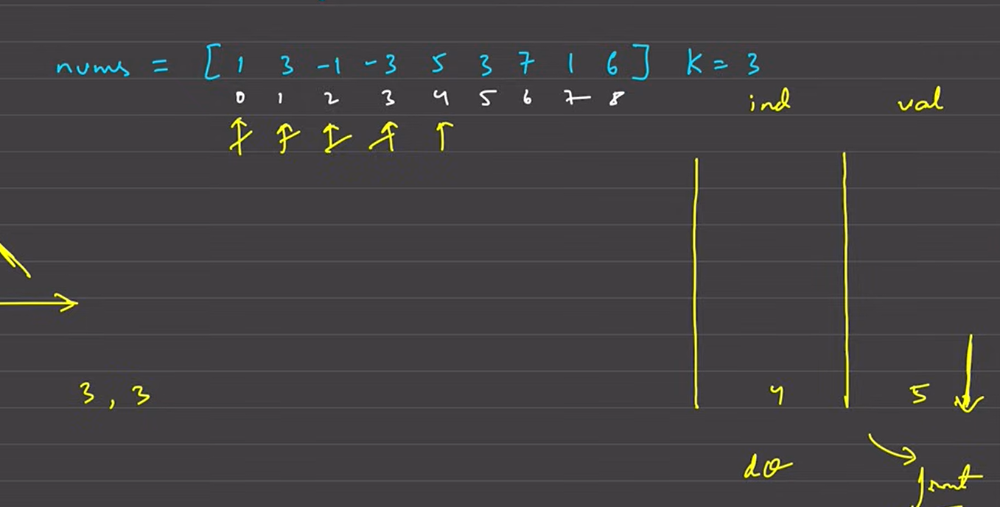

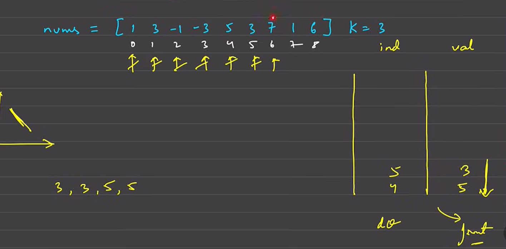

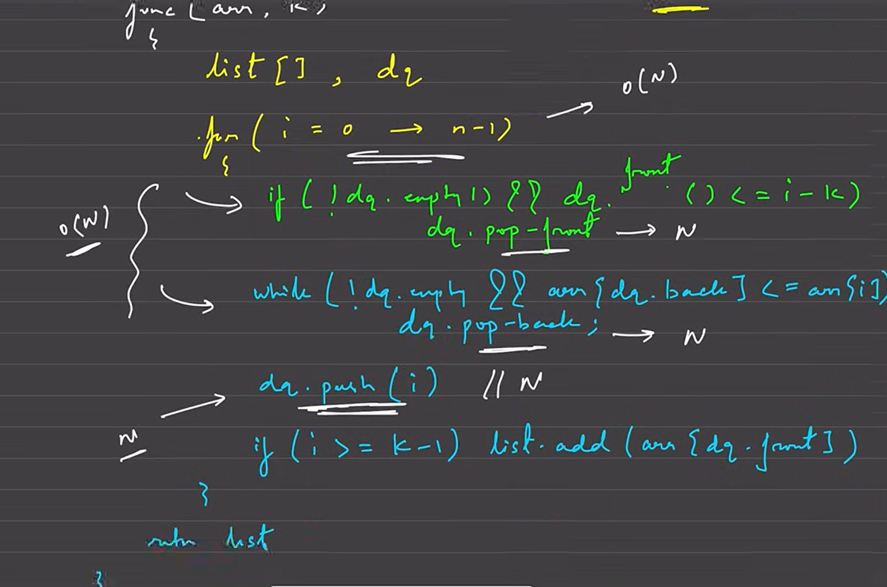

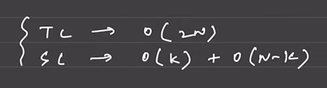