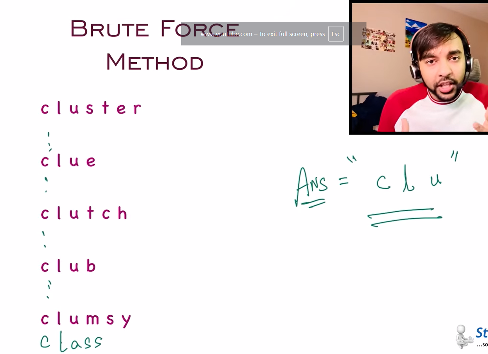
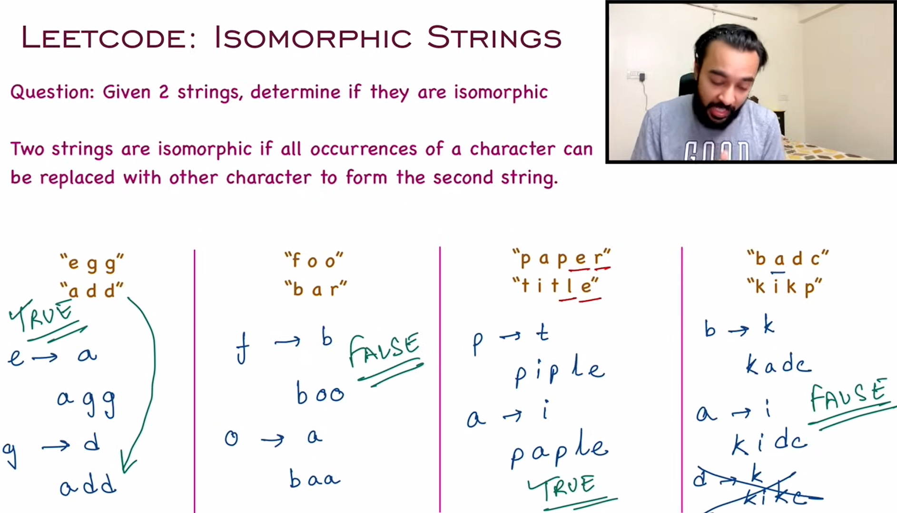
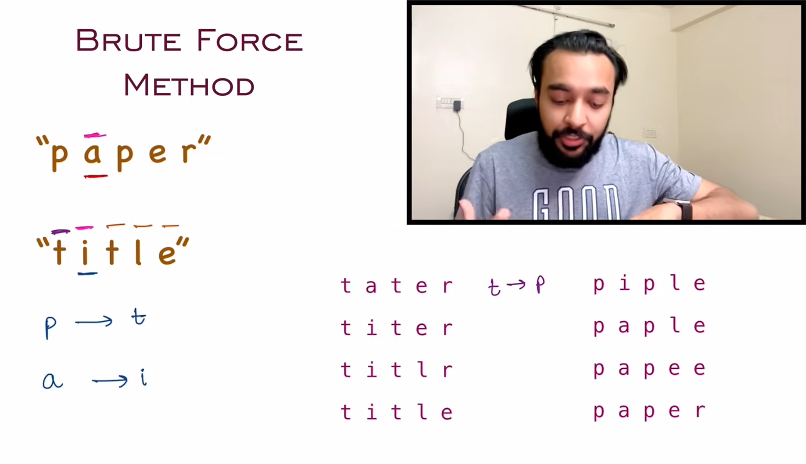
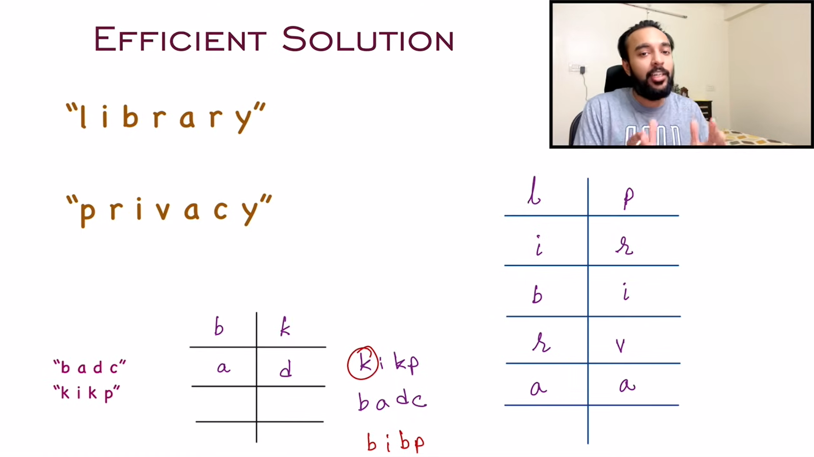
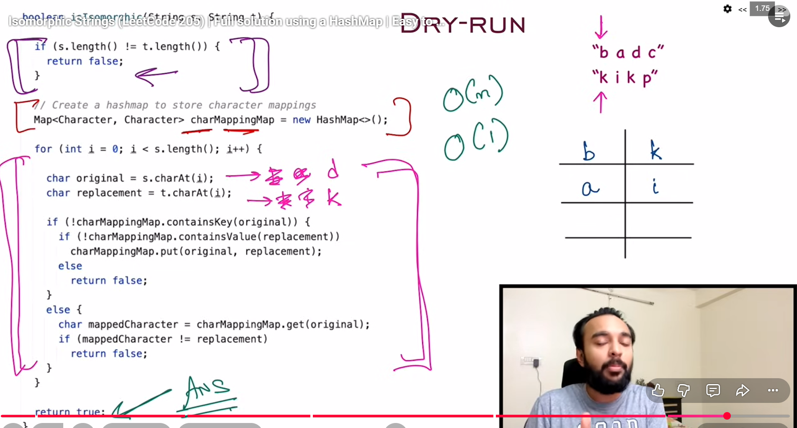

parenthesis

stack based
if empty push into stack but not to answer
during pop if after pop stack is emppty so dont push into answer ')' 

make counter instead of stack if 0 dont push into ans and in pop if 0 dont push into answer

reverse string word

prefix

better -> sort array now check only first and last word for long

isomorphic

using hasmap O(1)

