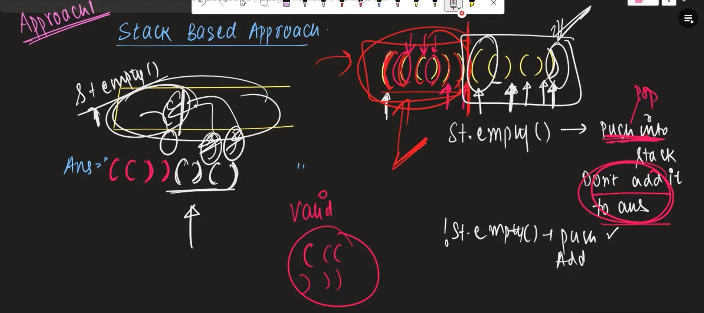
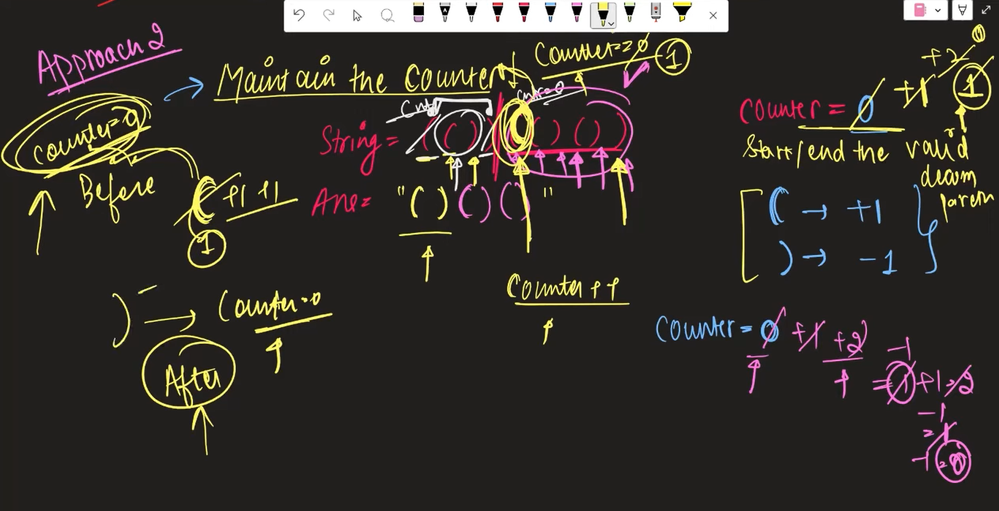
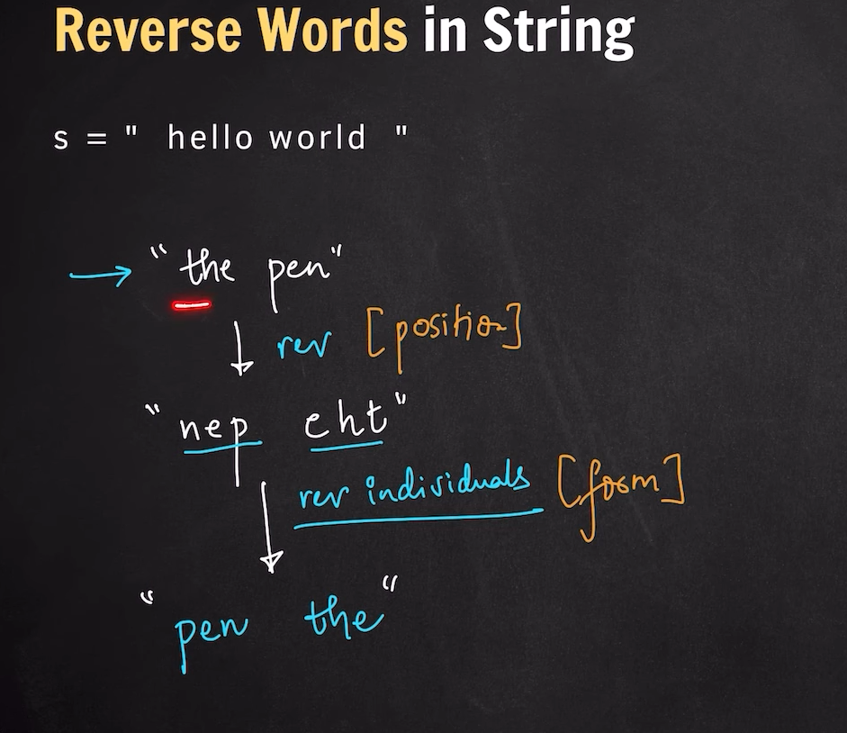
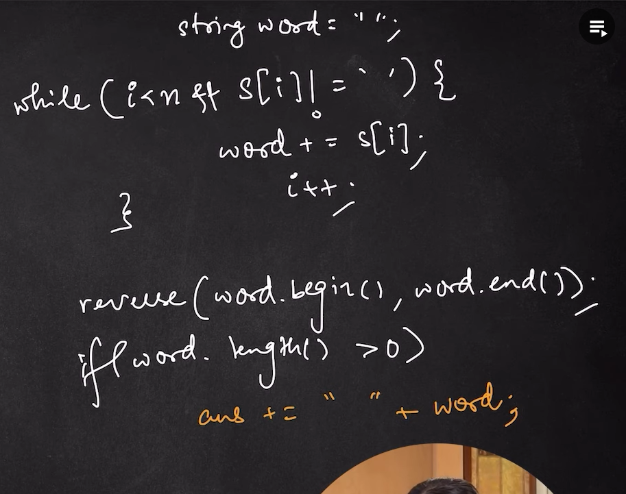
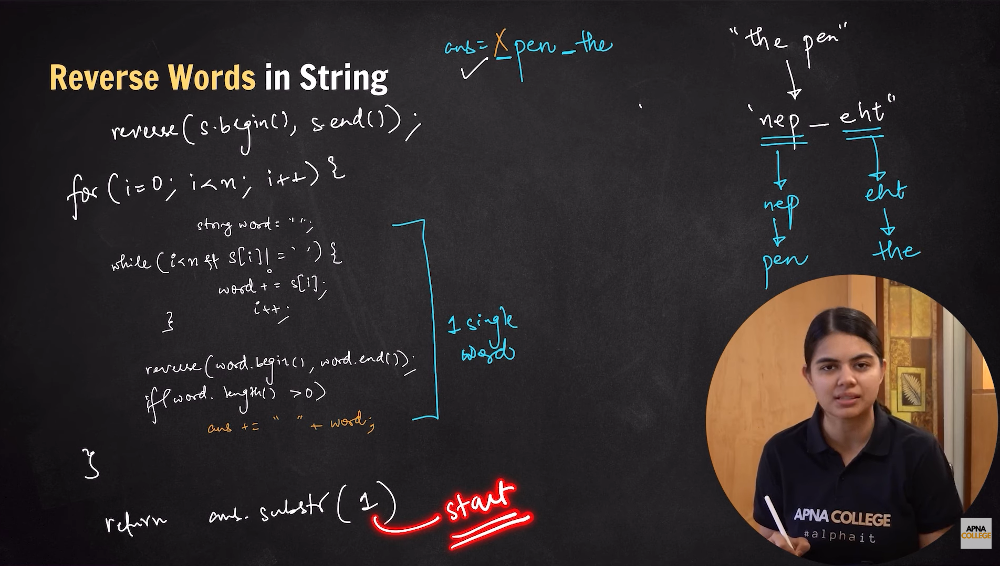

parenthesis

stack based
if empty push into stack but not to answer
during pop if after pop stack is emppty so dont push into answer ')' 

make counter instead of stack if 0 dont push into ans and in pop if 0 dont push into answer

reverse string word

